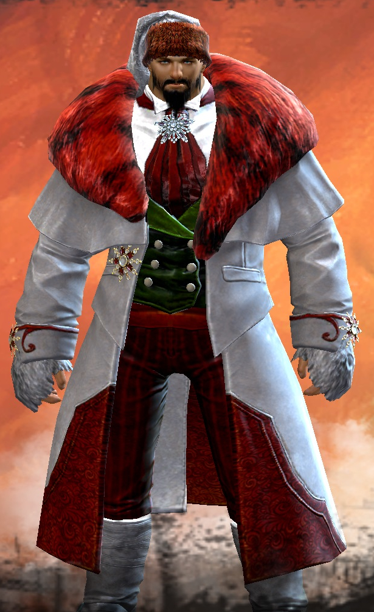
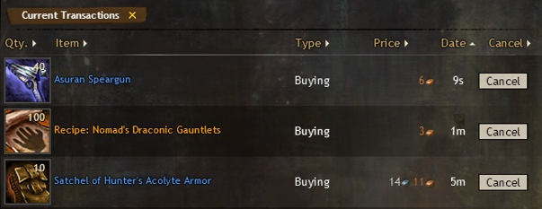

```{r init, message=FALSE, warning=FALSE, include=FALSE}
library(tidyverse)
library(readr)
library(scales)

library(ggplot2)
library(gt)
library(gtable)
library(DT)
```
# TODOs

Using the data science lifecycle of **plan**, **data**, **model** and **deployment**, I want to provide insights into many aspects of data science, programming in R and the world of the online game Guild Wars 2.

[data science lifecycle](images/lifecycle.png)

# Plan

## Use-Case and Problem

Malcolm Forbes once said, "Money isn't everything as long as you have enough of it".
Sure, money doesn't buy happiness, but it can buy a lot of things. This is not only true for the real world, but especially in online games, where micro transactions and payed services have become the new normal. 

More and more games give you the choice to invest a lot of time *or* a lot of money. Both ways you'll somehow achieve the goal of the game faster. In some games you can even exchange digital goods for real money.

To get to the point, having digital currency in games can save you time, stress and even real money.

There are multiple ways to earn money in games.
Often you'll get on with just playing the game and getting some money from enemies, but for buying the *good* stuff, one needs a lot more money. 

One way may be farming, which means hunting special items in high amounts and selling them to other players. Here's the question, which items are worth collecting and can be sold for which prices?

Another way is buying items from other players and reselling them with a higher price tag, just like in the real world.
Many games have auction houses where those transactions can be made. For this type of income one needs to know what to buy when, which prices are low or high, and when to sell for which amount.

For this project my example of game will be Guild Wars 2. Guild Wars 2 was published in 2012 by NCSoft. There are no monthly fees and the basic game is free to play since 2015. It is a massively multiplayer online role-playing game, meaning a lot of people playing in parallel in an online world. There are over 20.000 items that can be collected and many of them can be sold and bought at the auction house, called the trading post.

[trading post](images/Trading_Post_home.jpg)

This is a picture of the auction house. There are many different types of items (Armor, Weapons, ...)

When selling items, 5% of the cost is a fee for the auction house and gets immediately taken from your wallet.
Each time an item is placed in the auction house, this 5% fee must be payed, so it's best if the items get sold on the first run.
When buying items, 10% of the price goes to the bank before the rest is delivered to the seller.

Because of that it's important to find items where the buy-to-sell price ratio is the highest.
In addition, as we buy **and** sell, we have to pay the whole 15% taxes which lowers our revenue.

Buying and selling items this way is called `flipping items` in Guild Wars speech.

This is how it works:

1. We want to buy an item so we create a new order with the highest order price (say: 1 gold)
2. As soon as another player wants to sell this item, the player will sell it to us (for 1 gold)
3. We then create a new auction for this item using the lowest offer price (say: 2 gold). We have to pay 5% for creating this auction.
4. As soon as another player wants to buy this item, the player will buy it from us for 2 gold. During this transaction, 10% is a fee for the bank, so we get 10% less.

Overall, we invested `1.05 gold` and earned `1.8 gold`. This is a revenue of `0.75 gold`.

We always want to be the highest order and lowest offer, because if someone sells/buys *blindly*, the game will automatically take the best price for the player.

To make one thing clear, there are already a lot of web pages offering this or similar kind of services like [GW2Efficiency](https://gw2efficiency.com/tradingpost) or [GW2TP](https://de.gw2tp.com/) on a much higher level. 
This should only be a fun project exploring the R language and data science in general.

## Identify variables

For making the most out of our data, we can try to identify some important variables.

1. For buying low and selling high, we need to know everything about the `prices` like average, mean and quantiles.
2. Where is the highest `difference` between buy and sell `prices`?
2. Are there any `outliers` that are must-buys?
3. What is the `quantity` of items on the market? 
4. Are there any special `times` when people buy/sell?
5. Investing in one item, what is the `return of investment (ROI)`?


## Define Metrics

Currently I'm really inexperienced with the auction market. I just buy the items I need.

The goal is to earn at least `18 gold and 6 silver` just by buying/selling items that the exploration/model rates as highest ROI.
This is the current values of `1$`.

# Data

## Aquire data

The data we need can be fetched from a REST API at https://api.guildwars2.com.
There is also a good [documentation](https://wiki.guildwars2.com/wiki/API:Main) on how to use the API.

We'll use three endpoint here:
1. Get all items there are in the game

For each item:

2. Get selling and buying listings from auction house api
3. Get basic information about the item like name, rarity etc.

At the end we can merge all this data to get a good overview of which items are sold/bought at the auction house.
When joining all this together, we get a huge dataset of:

- nearly `30.000 items`
- around `500.000 buy auctions (orders)` 
- over `4.300.000 sell auctions (offers)`.

There are also APIs where authorization is needed to get information about one's user profile, but we won't need this data for this analysis.

The code can be found in the file `scrape.Rmd`.

One important thing to notice: The api can be called with 1 - 200 items (IDs as query parameters).
It is much more performant to call the API in batches of 200 items.

## Data ingestion

Load the data from CSV. 
We don't want to get that amount of data from the API again and again.

```{r load_csv, message=FALSE, warning=FALSE}
dir <- getwd()
date <- "2022-04-01"

price_list_buys <- read.csv(paste(dir, "/gw2-all-buys-raw-", date, ".csv", sep = ""))
price_list_sells <- read.csv(paste(dir, "/gw2-all-sells-raw-", date, ".csv", sep = ""))
item_list <- read.csv(paste(dir, "/gw2-all-items-raw-", date, ".csv", sep = ""))

df_buys <- item_list %>% left_join(price_list_buys)
df_sells <- item_list %>% left_join(price_list_sells)

rm(dir)
rm(date)
rm(item_list)
rm(price_list_sells)
rm(price_list_buys)
```

To get a quick impressions of the data, let's have a look at the rough numbers.

This is how the buyer data looks like:
```{r glimpse_buys}
glimpse(df_sells)
```

The seller data has the same structure, just for all the offers: 
```{r glimpse_sells}
glimpse(df_buys)
```

- **name**: This is the name of the item.
- **type**: can be something like `armor`, `consumable`, `crafting material` and so on
- **rarity**: There are 8 types of rarity from very common to very rare.
- **vendor_value**: What a sell to a NPC dealer would yield.
- **id**: Unique ID of the item.
- **icon**: URL to a picture of the item
- **level**: Level required to use this item (1-80)
- **item_type**: More detailed type of the item, based on basic type
- **item_weight_class**: Especially for armor, who can use the item
- **listings**: How many players are offering this item to this price
- **unit_Price**: What the player wants for this item (in copper)
- **quantity**: How many offers of this items there are for this price.

Listings, Unit_Price and Quantity can be read together.

E.g. for the first data entry:

- There is 1 (`listings`) player 
- offering 17 (`quantity`) pieces of this item 
- for 168 (`unit_price`) copper each.

We'll learn more about copper shortly.


Compare total items of **all** buys and sells:

```{r total_entries}
nrow(df_sells)
nrow(df_buys)
```

Compare **unique** items of buys and sells:

```{r total_items}
df_sells %>% 
  select(name) %>% 
  drop_na() %>% 
  unique() %>% 
  count() %>% 
  first()

df_buys %>% 
  select(name) %>% 
  drop_na() %>% 
  unique() %>% 
  count() %>% 
  first()
```

Let's have a closer look at the data if we need to clean anything.

## Data Cleaning 

### Currency


Just like in the real world, where 100 cents are 1 Euro, 
the main currency in Guild Wars, coins, are separated into three units.

There is copper, silver and gold. All those values are the same and are automatically calculated by the game.

`
10.000 copper == 100 silver == 1 gold.
`

So we need to divide all values by `10.000` to display the price in gold, which is good for expensive goods and when we are searching for the upper prices.

There may be occasions where it makes more sense to look for silver or even copper, but let's introduce the price as gold first.

```{r add_price_in_gold}
df_sells <- df_sells %>% 
  mutate(unit_price_gold = unit_price / 10000,
         unit_price_silver = unit_price / 100,
         unit_price_copper = unit_price) %>% 
  select(-unit_price)

df_buys <- df_buys %>% 
  mutate(unit_price_gold = unit_price / 10000,
         unit_price_silver = unit_price / 100,
         unit_price_copper = unit_price) %>% 
  select(-unit_price)
```

### Listings and Quantities 

In the dataset, there are listings and quantities. Each row is one or more player offering or ordering one type of item for one specific price.
We don't have to care much about listings, as it's only a subcategory of quantity, so let's get rid of it.

```{r remove_listings}
df_sells <- df_sells %>% 
  select(-listings)

df_buys <- df_buys %>% 
  select(-listings)
```

### Categorical values

Those are categorical values with a static set and can therefore be treated as factors.

```{r categorical_values_factors}
df_sells <- df_sells %>% 
  mutate(rarity = as.factor(rarity),
         type = as.factor(type),
         item_type = as.factor(item_type),
         item_weight_class = as.factor(item_weight_class))

df_buys <- df_buys %>% 
  mutate(rarity = as.factor(rarity),
         type = as.factor(type),
         item_type = as.factor(item_type),
         item_weight_class = as.factor(item_weight_class))
```

This will make it easier to use their distinct values

```{r types}
df_types <- data.frame(levels(df_sells$type))
df_types %>% 
gt(rowname_col = "name") %>%
  tab_header(title = "Types")
```

```{r rarity}
df_rarity <- data.frame(levels(df_sells$rarity))
df_rarity %>% 
gt(rowname_col = "name") %>%
  tab_header(title = "Rarity")
```

## Analyze Data

### Item prices

```{r top5_expensive_items, message=FALSE, warning=FALSE}
df_sells_group <- df_sells %>% 
  group_by(name) %>% 
  summarise(mean_unit_price = mean(unit_price_gold), 
            mean_vendor_value = mean(vendor_value) / 10000,
            type = unique(type),
            rarity = unique(rarity)) %>% 
  arrange(desc(mean_unit_price))

top5 <- top_n(ungroup(df_sells_group), 5, mean_unit_price)

top5 %>% 
  ggplot() +
  geom_bar(aes(x = name, y = mean_unit_price, fill = rarity), stat="identity") +
  geom_point(aes(x = name, y = mean_vendor_value), fill = "#000000", stat="identity") +
  theme(axis.text.x = element_text(angle = 90, vjust = 0.5, hjust=1)) +
  scale_x_discrete(limits = top5$name) +
  labs(x = "Name", y = "Mean price", title = "Most expensive items")
```

`9999 gold` seems to be the maximum possible price for an auction.
Vendor prices are so low (copper range), that they appear as nearly zero points in this chart.

Our top item here, the `Festive Grymm Svaard`, is a cosmetic item that can only be bought with real money and a lot of luck.
This is only an offer, so we'll have to find out if anyone would ever buy this item to this price.

```{r buy_prices_festive_grymm_svaard, message=FALSE, warning=FALSE}

df_buys %>% 
  filter(name == 'Festive Grymm Svaard') %>% 
  select(name, unit_price_gold) %>%
  top_n(5) %>% 
  arrange(desc((unit_price_gold))) %>% 
  gt(rowname_col = "name") %>%
  tab_header(title = "Orders of the Festive Grymm Svaard") %>%
  fmt_number(
    columns = unit_price_gold
  )
```


As we can see, the highest order on this item is 300 gold. 
That's pretty much, but far away from 9999.

But who doesn't want to look that fancy.
Cordyceps


#### High profit items

For our goal to buy low and sell high, we need to know which items have the best profit.
As explained before, because of taxes, profit means `85% of the sell price` - `buy price`.

We first need to organize our data to calculate the difference between buys and sells:

```{r merge_buys_sells}
df_all <- df_buys %>% 
  select(id, name, unit_price_gold, quantity) %>% 
  left_join(df_sells %>% 
              select(id, unit_price_gold, quantity),
            by = "id", suffix = c("_buys", "_sells"))
```

Now we can calculate the profit:

```{r calculate_diffs}
df_all <- df_all %>% 
  mutate(unit_price_gold_diff = unit_price_gold_sells - unit_price_gold_buys,
         profit = 0.85 * unit_price_gold_sells - unit_price_gold_buys,
         quantity_diff = quantity_sells - quantity_buys) %>% 
  filter(profit > 0) %>% 
  arrange(unit_price_gold_diff) %>% 
  filter(quantity_diff > 0)
```

Let's have a look at the top 100 items with the highest profit.
As we can see, even the top 100 are very special items that aren't often traded (`quantity` < 10).

This is interesting, but it doesn't seem to be a good fit for real trading.

```{r cost_distribution1, message=FALSE, warning=FALSE}
df_top_profit <- df_all %>% 
  group_by(name) %>% 
  summarise(profit = round(min(profit), digits = 2),
            id = unique(id),
            quantity = min(quantity_diff)) %>% 
  ungroup() %>% 
  arrange(desc(profit)) %>%
  head(100)

df_top_profit <- df_top_profit %>%
  left_join(df_sells %>% select(id, rarity, level, icon), by = "id") %>%
  mutate(icon = web_image(icon, height = 25)) %>% 
  select(id, name, profit, rarity, level, quantity, icon) %>% 
  distinct(id, name, profit, rarity, level, quantity, icon) 
  
df_top_profit %>% 
  datatable(extensions = c('ColReorder', 'Buttons', 'Responsive', 'Scroller', 'SearchPanes', 'Select'),
            options = list(colReorder = TRUE,
                           dom = 'Bfrtip', 
                           buttons = list('searchPanes', 'copy', list(
                                           extend = 'collection',
                                           buttons = c('csv', 'excel', 'pdf'), 
                                           text = 'Download'))),
            escape = FALSE,
            colnames=c("#", "Name", "Profit", "Rarity", "Level", "Quantity", "Icon")
            )
```


#### Finding usable items

```{r}

df_high_roi <-  df_all %>% 
  group_by(name) %>% 
  summarise(
    id = unique(id),
    profitByCost = min(profit) / max(unit_price_gold_buys),
    profit = min(profit),
    cost = max(unit_price_gold_buys),
    quantity = min(quantity_buys)
  ) %>% 
  ungroup() %>% 
  arrange(desc(profitByCost))

df_high_roi %>% 
  ggplot(aes(x = cost,  y = profit)) +
  geom_point() +
  stat_summary(fun.data=mean_cl_normal) + 
  geom_smooth(method='lm', formula= y~x)
```
Great, we found items with very high profit.
Let's try it!



#### Cluster Analysis (WIP)

Create cluster (from https://www.kirenz.com/post/2020-05-21-r-hierarchische-clusteranalyse/)


```{r}
df_cl <- df_high_roi %>% 
  select(c("id", "profit", "cost"))

df_cl$profit <- scale(df_cl$profit, center = TRUE, scale = TRUE)
df_cl$cost <- scale(df_cl$cost, center = TRUE, scale = TRUE)

```

```{r}
df_cl %>% 
  ggplot(aes(cost, 
             profit, 
             label = id)) +
  geom_point() +
  geom_text(size = 3,
            check_overlap = FALSE,
            vjust = 0, nudge_y = 0.1) +
  theme_classic() +
  ylab("Profit") +
  xlab("Cost") 
```


```{r}
d <- 
  df_cl %>% 
  select(-id) %>% 
  dist(method = "euclidean")

hc <- hclust(d, method = "ward.D2") 
#sort(unique(cophenetic(hc)))

hc$labels <- df_cl$id

grp <- cutree(hc, k = 4) 
df_cl$cluster <- grp
```

```{r}

df_cl %>% 
  ggplot(aes(cost, 
             profit, 
             label = id,
             color = factor(cluster))) +
  geom_point() +
  geom_text(size = 3,
            check_overlap = FALSE,
            vjust = 0, nudge_y = 0.1) +
  theme_classic() +
  xlab("Cost") +
  ylab("Profit") +
  theme(legend.title=element_blank())
```


### Rarity of items

There are different rarities in Guild Wars that suggest how often this item will occur in the game:

```{r rarity_of_items, message=FALSE, warning=FALSE}
rarities <- c("Junk", "Basic", "Fine", "Masterwork", "Rare", "Exotic", "Ascended", "Legendary")
colors <- 
  c("Junk" = "#a3aeb9",
    "Basic" = "#000000",
    "Fine" = "#6a9cd9", 
    "Masterwork" = "#17911a", 
    "Rare" = "#f0cd25",
    "Exotic" = "#e9ad1a",
    "Ascended" = "#e64680",
    "Legendary" = "#53238a")

df <- data.frame(rarities)

df %>% 
  ggplot() +
  geom_bar(aes(x = rarities, fill = rarities)) +
  scale_x_discrete(limits = rarities) +
  scale_fill_manual("Rarity", values = colors) + 
  theme(axis.text.y=element_blank(),
        axis.title.y=element_blank(),
        axis.title.x=element_blank())
```

What is obvious by the names, rarity on the left is in general more common than rarity on the right.

One important information is that a lot of very rare items (`Ascended` and `Legendary`) can't be sold to other players. That's the reason we see much more `Rare` and `Exotic` items being sold for high prices than those really rare ones.
Junk is zero because it can only be sold at non-player vendors.

In our dataset, we have the following distribution:

```{r rarity_distribution}
df <- df_sells %>% 
  count(rarity) %>% 
  arrange(desc(n))

df %>% 
  ggplot() +
  geom_bar(aes(x = rarity, y = n, fill = rarity), stat='identity') +
  scale_x_discrete(limits = rarities) +
  scale_fill_manual("Rarity", values = colors)
```

### Types

There are a lot of different types of items.
As we can see, Armor, Consumables and Weapons are the most common items.

Here we only see the distribution of items in the game. There are no numbers about sells yet.

This means there are very many different weapon, consumable and armor items in the game, but not that many different crafting materials and upgrade components which seems reasonable.

```{r type_distribution}
df_types <- df_sells %>% 
  distinct(type, name) %>%
  group_by(type) %>% 
  count(type)

df_types %>% 
  ggplot() +
  geom_bar(aes(x = type, y = n, fill = type), stat='identity') +
  theme(axis.text.x = element_text(angle = 45, hjust=1))
```
Armors and Weapons can be further broken down into sub types:

```{r item_type_distribution}
df_item_types <- df_sells %>% 
  filter(type %in% c("Armor", "Weapon")) %>% 
  distinct(type, item_type, item_weight_class, name) %>%
  group_by(type, item_type, item_weight_class) %>% 
  count(item_type)

df_item_types %>% 
  ggplot() +
  geom_bar(aes(x = item_type, y = n, fill = item_weight_class), stat='identity') +
  facet_grid(df_item_types$type) +
  theme(axis.text.x = element_text(angle = 90, vjust = 0.3, hjust=1)) +
  labs(x = "Item types", y = "Count")
```

For armors we have the distinction between **Light** (for mages), **Medium** (for rangers) and **Heavy** (for warriors). 
Clothing are special items for the style points.
There is no such distinction for weapons. Different classes can use different weapons, but all of them can be used by more than one class.


Let's have a closer look at the type **Tinket**.

```{r trinket_overview, message=FALSE, warning=FALSE}

df_sells %>%
  filter(type == "Trinket") %>% 
  group_by(type, rarity) %>% 
  summarise(name = unique(name),
            mean = mean(unit_price_gold),
            icon = min(web_image(icon, height = 50))
            ) %>% 
  drop_na() %>% 
  arrange(desc(mean)) %>%
  gt(rowname_col = "name") %>%
  tab_header(title = "Trinkets", subtitle = "Items with special means") %>%
  fmt_number(
    columns = mean,
    suffixing = "G"
  ) %>% 
  fmt_markdown(
    columns = icon
  ) %>% 
  summary_rows(
    columns = mean,
    fns = list(TOTAL = "sum"),
    formatter = fmt_number
  ) %>%
  tab_footnote(
    footnote = "Prices in gold",
    locations = cells_column_labels(columns = mean)
  ) %>%
  tab_source_note(
    "Based on data from api.guildwars2.com"
  ) %>% 
  tab_options(
    summary_row.background.color = "#ACEACE",
    row_group.background.color = "#FFEFDB",
    table.layout = "auto",
    container.overflow.x = TRUE,
    container.height = px(350)
  )
```

### Crafting Material

Let's have a closer look on one of the most important resources in the game: Crafting material.

The base material can be collected everywhere in the world from trees, stones or herbs.
As a player, you can learn up to two professions that can improve those base materials to something better and useful.

Let's first check if there are any outliers in the data that we should clean.

```{r outliers_crafting}
mean_price_crafting_sells <- df_sells %>% 
  filter(type == "CraftingMaterial")

mean_price_crafting_buys <- df_buys %>% 
  filter(type == "CraftingMaterial")

ggplot() +  
  geom_boxplot(data = mean_price_crafting_sells, aes(x = 'Sells', y = unit_price_gold)) +
  geom_boxplot(data = mean_price_crafting_buys, aes(x = 'Buys', y = unit_price_gold)) +
  geom_hline(yintercept = 999, linetype="dashed", color = "red") +
  scale_y_continuous(labels = comma)

```

We can see that on the buys, there aren't any outliers because the `human brain` is still working and no one buys overpriced goods.
On the other hand, on the sells there are some people who are exaggerating with the prices.
Let's strip everything at 1000 and above.

```{r overview_crafting, message=FALSE, warning=FALSE}

df_sells_crafting_material <-  df_sells %>% 
  filter(type == "CraftingMaterial",
         unit_price_gold < 1000) %>% 
  group_by(rarity, name) %>% 
   summarize(
    mean_price = mean(unit_price_gold),
    sum_quantity = sum(quantity),
    picture = web_image(unique(icon), height = 25)
  ) %>% 
  mutate(
    quantity_label = label_number_si(accuracy=0.1)(sum_quantity),
    mean_price_gold = round(mean_price, digits = 3)) %>% 
  arrange(desc(sum_quantity)) %>% 
  select(rarity, name, mean_price_gold, quantity_label, sum_quantity, picture)

df_sells_crafting_material %>% 
  datatable(extensions = c('ColReorder', 'Buttons', 'Responsive', 'Scroller', 'SearchPanes', 'Select'),
            options = list(colReorder = TRUE,
                           dom = 'Bfrtip', 
                           buttons = list('searchPanes', 'copy', list(
                                           extend = 'collection',
                                           buttons = c('csv', 'excel', 'pdf'), 
                                           text = 'Download'))),
            escape = FALSE,
            colnames=c("#", "Rarity", "Name", "Mean price in gold", "Quantity (short)", "Quantity", "Icon")
            )

exp_sell_item_name <- df_sells_crafting_material %>% 
  arrange(desc(mean_price_gold)) %>% 
  ungroup() %>%
  select(name) %>% 
  first() %>% 
  first()

```

Looking at Crafting Material, we first see that there is an overwhelming amount of offers on the market.
There are `r df_sells_crafting_material$quantity_label[[1]]` items of `r df_sells_crafting_material$name[[1]]`!
**Nougat Center**, **Chattering Skull** and **Plastic Fangs** are all Halloween Event items and therefore not hard to get but also not very useful.

The first real crafting material is `Large Claw`, with still over 
`r df_sells_crafting_material %>%  filter(name == 'Large Claw') %>% ungroup() %>%  select(quantity_label) %>% first()` items.

The most expensive mean crafting material is `r exp_sell_item_name`.


## Define schema


> If possible, it's always better to sell items on the action house instead of the vendor.
-> really?
