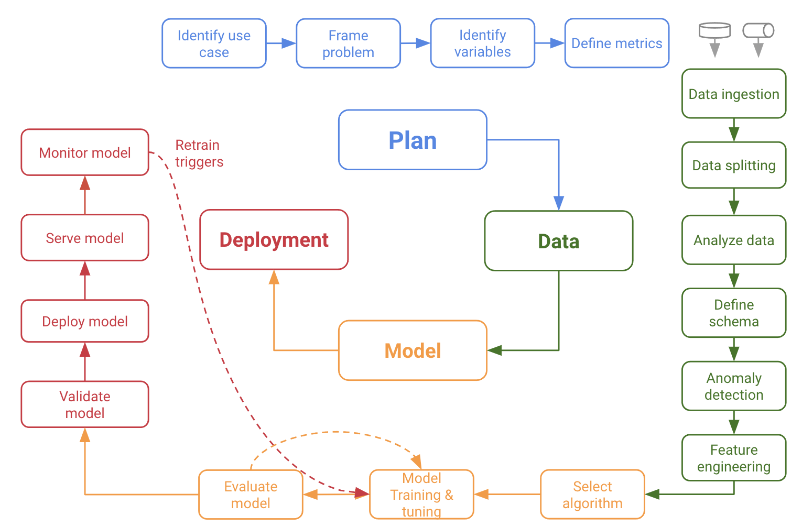
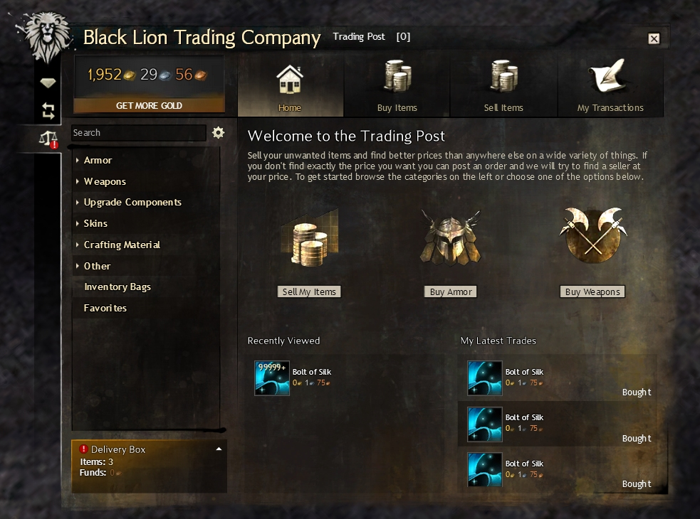

```{r init, message=FALSE, warning=FALSE, include=FALSE}
library(tidyverse)
library(readr)
library(visdat)

library(ggplot2)
library(gt)
library(gtable)
library(DT)

library(rsample)
library(tidymodels)
library(GGally)
library(corrr)
library(parsnip)

library(randomForest)
library(ranger)

tidymodels_prefer()
```
# TODOs


Using the data science lifecycle of **plan**, **data**, **model** and **deployment**, I want to provide insights into many aspects of data science, programming in R and the world of the online game Guild Wars 2.



# Plan

## Use-Case and Problem

Malcolm Forbes once said, "Money isn't everything as long as you have enough of it".
Sure, money doesn't buy happiness, but it can buy a lot of things. This is not only true for the real world, but especially in online games, where micro transactions and payed services have become the new normal. 

More and more games give you the choice to invest a lot of time *or* a lot of money. Both ways you'll somehow achieve the goal of the game faster. In some games you can even exchange digital goods for real money.

To get to the point, having digital currency in games can save you time, stress and even real money.

There are multiple ways to earn money in games.
Often you'll get on with just playing the game and getting some money from enemies, but for buying the *good* stuff, one needs a lot more money. 

One way may be farming, which means hunting special items in high amounts and selling them to other players. Here's the question, which items are worth collecting and can be sold for which prices?

Another way is buying items from other players and reselling them with a higher price tag, just like in the real world.
Many games have auction houses where those transactions can be made. For this type of income one needs to know what to buy when, which prices are low or high, and when to sell for which amount.

For this project my example of game will be Guild Wars 2. Guild Wars 2 was published in 2012 by NCSoft. There are no monthly fees and the basic game is free to play since 2015. It is a massively multiplayer online role-playing game, meaning a lot of people playing in parallel in an online world. There are over 20.000 items that can be collected and most of them can be sold and bought at the auction house, called the trading post.



This is a picture of the auction house. There are many different types of items (Armor, Weapons, ...)

When selling items, 5% of the cost is a fee for the auction house and gets immediately taken from your wallet.
Each time an item is placed in the auction house, this 5% fee must be payed, so it's best if the items get sold on the first run.

When buying items, 10% of the price goes to the bank before the rest is delivered to the seller.

Because of that it's important to find items where the buy-to-sell price ratio is the highest.
In addition, as we buy **and** sell, we have to pay the whole 15% taxes which lowers our revenue.

Buying and selling items this way is called `flipping items` in Guild Wars speech.

This is how it works:

1. We want to buy an item so we create a new order with the highest order price (say: 1 gold)
2. As soon as another player wants to sell this item, the player will sell it to us (for 1 gold)
3. We then create a new auction for this item using the lowest offer price (say: 2 gold). We have to pay 5% for creating this auction.
4. As soon as another player wants to buy this item, the player will buy it from us for 2 gold. During this transaction, 10% is a fee for the bank, so we get 10% less.

Overall, we invested `1.05 gold` and earned `1.8 gold`. This is a revenue of `0.75 gold`.

We always want to be the highest order and lowest offer, because if someone sells/buys *blindly*, the game will automatically take the best price for the player.

To make one thing clear, there are already a lot of web pages offering this or similar kind of services like [GW2Efficiency](https://gw2efficiency.com/tradingpost) or [GW2TP](https://de.gw2tp.com/) on a much higher level. 
This should only be a fun project exploring the R language and data science in general.

## Identify variables

The data is rather big but already structured for us (JSON).

For making the most out of our data, we need to identify some important features. 

Which features do we already have?

- **name**: This is the name of the item.
- **type**: can be something like `armor`, `consumable`, `crafting material` and so on
- **rarity**: There are 8 types of rarity from very common to very rare.
- **vendor_value**: What a sell to a NPC dealer would yield.
- **id**: Unique ID of the item.
- **icon**: URL to a picture of the item
- **level**: Level required to use this item (1-80)
- **item_type**: More detailed type of the item, based on basic type
- **item_weight_class**: Especially for armor, who can use the item
- **listings**: How many players are offering this item to this price
- **unit_Price**: What the player wants for this item (in copper)
- **quantity**: How many offers of this items there are for this price.

Which features may have impact on the **unit_Price**?

- **type**, **rarity**, **level**, **item_type**, **item_weight_class**, **quantity**

Which features could be created in addition?

1. The `profit` which is the difference between `buy` and `sell prices`, taken taxes into account
2. What is the `return of investment (ROI)`, taking initial costs into account
3. One interesting number is the `relative estimation window` between high and low estimates (or in our case, orders/offers) taken from [this book](https://islandora.wrlc.org/islandora/object/1112capstones%3A217/datastream/PDF/view). If the variance is 0, this values would be 1. If the prices are very different, this value will raise.

## [WIP] Define Metrics

The goal is to earn at least `18 gold and 6 silver` just by buying/selling items that the exploration/model rates as highest ROI.
This is the current values of `1$`.


TODO: Add metrics for the model

# Data

## Aquire data

The data we need can be fetched from a REST API at https://api.guildwars2.com.
There is also a good [documentation](https://wiki.guildwars2.com/wiki/API:Main) on how to use the API.

We'll use three endpoint here:

- Get all items there are in the game

For each item:

- Get selling and buying listings from auction house api
- Get basic information about the item like name, rarity etc.

At the end we can merge all this data to get a good overview of which items are sold/bought at the auction house.
When joining all this together, we get a huge dataset of:

- nearly `30.000 items`
- around `500.000 buy auctions (orders)` 
- over `4.300.000 sell auctions (offers)`.

There are also APIs where authorization is needed to get information about one's user profile, but we won't need this data for this analysis.

The code can be found in the file `scrape.Rmd`.

One important thing to notice: The api can be called with 1 - 200 items (IDs as query parameters).
It is much more performant to call the API in batches of 200 items.

## Data ingestion

Load the data from CSV. 
We don't want to get that amount of data from the API again and again.

```{r load_csv, message=FALSE, warning=FALSE}
dir <- getwd()
date <- params$data_date

price_list_buys <- read.csv(paste(dir, "/../data/raw/gw2-all-buys-raw-", date, ".csv", sep = ""))
price_list_sells <- read.csv(paste(dir, "/../data/raw/gw2-all-sells-raw-", date, ".csv", sep = ""))
item_list <- read.csv(paste(dir, "/../data/raw/gw2-all-items-raw-", date, ".csv", sep = ""))

df_buys <- item_list %>% left_join(price_list_buys)
df_sells <- item_list %>% left_join(price_list_sells)

rm(dir)
rm(date)
rm(item_list)
rm(price_list_sells)
rm(price_list_buys)
```

To get a quick impressions of the data, let's have a look at the rough numbers.

This is how the buyer data looks like:
```{r glimpse_buys}
glimpse(df_sells)
```

The seller data has the same structure, just for all the offers: 
```{r glimpse_sells}
glimpse(df_buys)
```


Listings, Unit_Price and Quantity can be read together.

- There is 1 (`listings`) player 
- offering 17 (`quantity`) pieces of this item 
- for 168 (`unit_price`) copper each.

We'll learn more about copper shortly.


Compare total items of **all** buys and sells:

```{r total_entries}
nrow(df_sells)
nrow(df_buys)
```

Compare **unique** items of buys and sells:

```{r total_items}
df_sells %>% 
  select(name) %>% 
  drop_na() %>% 
  unique() %>% 
  count() %>% 
  first()

df_buys %>% 
  select(name) %>% 
  drop_na() %>% 
  unique() %>% 
  count() %>% 
  first()
```

## Data Cleaning 

Because we get data from Guild Wars API, there is not much data cleaning needed.

We'll just create some more fields for convenience and change some data types.

### Data corrections

First of all, let's check if there are any n/a values and drop them.

```{r}
df_sells <- df_sells %>%
  drop_na(unit_price, quantity)

df_buys <- df_buys %>% 
  drop_na(unit_price, quantity)

df_sells %>%
  filter(is.na(unit_price))

df_buys %>%
  filter(is.na(unit_price))
```


Just like in the real world, where 100 cents are 1 Euro, 
the main currency in Guild Wars, coins, are separated into three units.

There is **copper**, **silver** and **gold**. 

The following values are all the same and are automatically calculated by the game:
`
10.000 copper == 100 silver == 1 gold.
`

So we need to divide all values by `10.000` to display the price in gold, which is good for most goods. There may be occasions where it makes more sense to look for silver or even copper, but let's introduce the price as gold first.

```{r add_price_in_gold}
df_sells <- df_sells %>% 
  mutate(unit_price_gold = unit_price / 10000) %>% 
  select(-unit_price)

df_buys <- df_buys %>% 
  mutate(unit_price_gold = unit_price / 10000) %>% 
  select(-unit_price)
```

In the dataset, there are listings and quantities. Each row is one or more player offering or ordering one type of item for one specific price.
We don't have to care much about listings, as it's only a subcategory of quantity, so let's get rid of it.

```{r remove_listings}
df_sells <- df_sells %>% 
  select(-listings)

df_buys <- df_buys %>% 
  select(-listings)
```

Those are categorical values with a static set and can therefore be treated as factors.

```{r categorical_values_factors}
df_sells <- df_sells %>% 
  mutate(rarity = as.factor(rarity),
         type = as.factor(type),
         item_type = as.factor(item_type),
         item_weight_class = as.factor(item_weight_class))

df_buys <- df_buys %>% 
  mutate(rarity = as.factor(rarity),
         type = as.factor(type),
         item_type = as.factor(item_type),
         item_weight_class = as.factor(item_weight_class))
```

This will make it easier to use their distinct values

There are some numeric values that are hard to compare so let's normalize them

```{r}

df_sells <- df_sells %>% 
  mutate(level = level / 80,
         quantity_rel = quantity / max(quantity))

df_buys <- df_buys %>% 
  mutate(level = level / 80,
         quantity_rel = quantity / max(quantity))
```

Create some helper for feature names.

```{r}
feat_cat <- 
  df_sells %>% 
  select(!where(is.numeric), -name, -icon) %>%
  names()

feat_num <- 
  df_sells %>% 
  select(where(is.numeric), -id) %>% 
  names()
```


Let's check if all data types are correct now.

```{r}
vis_dat(df_buys %>%
  unique(), warn_large_data = FALSE)
```

Looks good! There are some empty values on item_type and item_weight_class which is expected because only some items have this type of category.
The data frame `df_sells` is a lot bigger and will take a while to compute, but it'll look exactly the same.

### Creation of new variables

As described before, to see the variance of orders and offers for one item, we can calculate `High Estimate / Low Estimate`.

```{r}
df_buys <- df_buys %>% 
  mutate(estimation_window = round(max(unit_price_gold)/min(unit_price_gold), digits = 2))

df_sells <- df_sells %>% 
  mutate(estimation_window = round(max(unit_price_gold)/min(unit_price_gold), digits = 2))

```

For our goal to buy low and sell high, we need to know which items have the best profit.
Therefore we need to `join` buys and sells and calculate the difference between sells and buys (respecting taxes).

We only take the highest buy orders and the lowest sell orders, because these are the first ones to be bought/sold.

```{r merge_buys_sells}
df_max_buys <-  df_buys %>% 
  group_by(name) %>% 
  slice(which.max(unit_price_gold))

df_min_sells <-  df_sells %>% 
  group_by(name) %>% 
  slice(which.min(unit_price_gold))

df_all <- df_max_buys %>%
  mutate(quantity_buys = quantity,
         unit_price_gold_buys = unit_price_gold,
         estimation_window_buys = estimation_window) %>% 
  select(-quantity, -unit_price_gold, -estimation_window) %>% 
  right_join(df_min_sells %>% 
              mutate(quantity_sells = quantity,
                     unit_price_gold_sells = unit_price_gold,
                     estimation_window_sells = estimation_window) %>% 
              select(id, quantity_sells, unit_price_gold_sells, estimation_window_sells), by = "id") %>% 
  mutate(name = name.x) %>% 
  select(-name.x, -name.y)

```
Now we can calculate the profit:

```{r calculate_diffs}
df_all <- df_all %>% 
  mutate(unit_price_gold_diff = unit_price_gold_sells - unit_price_gold_buys,
         profit = 0.85 * unit_price_gold_sells - unit_price_gold_buys,
         more_sells = quantity_sells - quantity_buys)
```

Let's have a look what we have now:

```{r}

df_all %>% 
  ggplot(aes(unit_price_gold_buys, 
             unit_price_gold_diff, 
             label = id)) +
  geom_point() +
  geom_text(size = 3,
            check_overlap = FALSE,
            vjust = 0, nudge_y = 0.1) +
  theme_classic() +
  xlab("Mean unit sell prices in gold") +
  ylab("Mean sell estimation window") +
  theme(legend.title=element_blank())

df_all %>% 
ggplot() +  
  geom_boxplot(aes(x = 'Sells', y = unit_price_gold_sells)) +
  geom_boxplot(aes(x = 'Buys', y = unit_price_gold_buys)) +
  geom_boxplot(aes(x = 'Profit', y = profit)) +
  geom_hline(yintercept = 3000, linetype="dashed", color = "red") +
  geom_hline(yintercept = 100, linetype="dashed", color = "blue") +
  scale_y_continuous(labels = comma) +
  labs(title = "Outliers on buys and sells", subtitle = "Baseline between 100 and 3000 gold",
    x = "", y = "Price in gold", caption = paste("Data from", params$data_date))
```

As we can see there are some very high outliers and a lot of outliers between around 100 and 3000 gold.
We need to zoom in much more to see the details.

```{r}
df_all %>% 
  subset(profit < 2.5 & unit_price_gold_sells < 2.5) %>% 
ggplot() +  
  geom_boxplot(aes(x = 'Sells', y = unit_price_gold_sells)) +
  geom_text(aes(x = 'Sells', y = median(unit_price_gold_sells), label = median(unit_price_gold_sells)), size = 3, vjust = -1) +
  geom_boxplot(aes(x = 'Profit', y = profit)) +
  geom_text(aes(x = 'Profit', y = median(profit), label = median(profit)), size = 3, vjust = -0.5) +
  scale_y_continuous(labels = comma) +
  labs(title = "Outliers on profit and sells", subtitle = "Limit at 2.5 gold profit and sell price",
    x = "", y = "Price in gold", caption = paste("Data from", params$data_date))
```
```{r}
df_all %>% 
  filter(unit_price_gold_buys < 0.1) %>% 
ggplot() +  
  geom_boxplot(aes(x = 'Buys', y = unit_price_gold_buys)) +
  geom_text(aes(x = 'Buys', y = median(unit_price_gold_buys), label = median(unit_price_gold_buys)), size = 3, vjust = 1.5) +
  scale_y_continuous(labels = comma) +
  labs(title = "Outliers on buys", subtitle = "Baseline at 0.1 gold (10 silver)",
    x = "", y = "Price in gold", caption = paste("Data from", params$data_date))
```

We can now strip down the data even further.

Let's take only the items with a realistic profit and strip away the items where it would be better to sell them to the non-player vendor instead of placing them in the auction house.

```{r}
df_all <- df_all %>% 
  subset(profit > 0.04 & profit < 0.4)

df_all <- df_all %>% 
  subset(profit * 100 > vendor_value) %>% 
  arrange(desc(profit))
```

Now only `r nrow(df_all)` items left.

We can save this data as processed to quicker start with the analysis later.

```{r}
dir <- getwd()
date <- params$data_date

write_csv(df_all, file = paste(dir, "/../data/processed/gw2-all-processed-", date, ".csv", sep = ""))
```


Let's have a closer look at those items.

```{r df_all_overview, message=FALSE, warning=FALSE}

df_all %>%
  group_by(type, rarity) %>% 
  summarise(name = unique(name),
            mean = mean(profit),
            icon = min(web_image(icon, height = 50))
            ) %>% 
  drop_na() %>% 
  arrange(desc(mean)) %>%
  gt(rowname_col = "name") %>%
  tab_header(title = "Realistic top profit items", subtitle = "") %>%
  fmt_number(
    columns = mean,
    suffixing = "G"
  ) %>% 
  fmt_markdown(
    columns = icon
  ) %>% 
  summary_rows(
    columns = mean,
    fns = list(TOTAL = "sum"),
    formatter = fmt_number
  ) %>%
  tab_footnote(
    footnote = "Prices in gold",
    locations = cells_column_labels(columns = mean)
  ) %>%
  tab_source_note(
    "Based on data from api.guildwars2.com"
  ) %>% 
  tab_options(
    summary_row.background.color = "#ACEACE",
    row_group.background.color = "#FFEFDB",
    table.layout = "auto",
    container.overflow.x = TRUE,
    container.height = px(350)
  )
```

## [WIP] Split data

To make the data split reproducible, we set a seed.

We want to predict the gold price based on attributes of the item.

```{r}
set.seed(42)

# Put 3/4 of the data into the training set 
data_split <- initial_split(df_all, 
                           prop = 3/4, 
                           strata = profit, 
                           breaks = 4)

# Create dataframes for the two sets:
train_data <- training(data_split) 
test_data <- testing(data_split)
```

Create validation set (used during modeling)

```{r}
cv_folds <- 
  vfold_cv(train_data,
           v=5,
           strata = profit,
           breaks = 4)

df_train <- train_data 
```

Now work with the train data.

## Analyze Data

### Item prices

#### [WIP - overview]


Not sure if this makes sense.

```{r}
for (i in feat_cat) {
  p <- ggplot(df_train, aes_string(x=i)) +
  geom_bar()
  plot(p)
}

df_train %>% 
  select(unit_price_gold_buys, unit_price_gold_sells, quantity_buys, quantity_sells) %>% 
  ggscatmat(alpha = 0.2)

df_train %>%  
  select(type, profit) %>% 
  ggpairs(aes(fill = type))

```
#### Find correlations

```{r spearman_analysis}
df_train %>% 
  select(where(is.numeric), -more_sells, -profit, -quantity_rel, -unit_price_gold_diff) %>% # only select numerical data
  vis_cor(cor_method = "spearman", na_action = "pairwise.complete.obs")
```

We see that our data is pretty uncorrelated which makes it hard to find a good classification model. What we see is that buy and sell price are somewhat correlated as well as the level of the item to the vendor value.

The latter makes sense, as there must be some kind of algorithm that sets the sell price, probably also based on the item's level.

Following idea: A model that predicts the sell price based on the buy price. Then we search for outliers where the sell price was predicted too high. Probably those items are underrated somehow?

#### Price distribution

Let's have a look at the distribution of profit in general for these items.

```{r profit_distribution}
df_train_distribution <- df_train %>% 
  group_by(name) %>% 
  summarise(mean_profit = mean(profit),
            type = unique(type),
            rarity = unique(rarity)) %>% 
  arrange(desc(mean_profit))
  
df_train_distribution %>% 
  ggplot() +
  geom_histogram(aes(x =  mean_profit, fill = type), stat="count") +
  scale_x_binned(limits = c(0, 0.4)) +
  labs(x = "Mean profit", y = "Count",
       title = "Item profit distribution", subtitle = "Items by profit, in gold", 
       caption = paste("Data from", params$data_date))
```

#### Sell distribution 

```{r sell_distribution}

min <- df_train %>% 
  summarise(sells = min(more_sells)) %>% 
  first()

df_train_distribution <- df_train %>% 
  group_by(name) %>% 
  summarise(sells = more_sells/min) %>% 
  ungroup() %>% 
  filter(sells != 0) %>% 
  arrange(desc(sells))
  
df_train_distribution %>% 
  ggplot() +
  geom_density(aes(sells)) +
  labs(x = "Buy/Sell distribution", y = "Count",
       title = "Item sell distribution", subtitle = "positive values: more sells than buys", 
       caption = paste("Data from", params$data_date))
```


#### Find profitable items

Starting with a low budget, we can't buy a lot of high-priced items. Therefore it's good to know which items get the most profit compared to their costs.
We always suppose *the worst* profit.

```{r}
df_train_high_roi <-  df_train %>% 
  group_by(name) %>% 
  summarise(
    id = unique(id),
    profitByCost = min(profit) / max(unit_price_gold_buys),
    profit = min(profit),
    cost = max(unit_price_gold_buys) * 100,
    sell = min(unit_price_gold_sells) * 100,
    quantity = min(quantity_buys)
  ) %>% 
  ungroup() %>% 
  arrange(desc(profitByCost))
```

```{r display_high_profit_regression}
df_train_high_roi %>% 
  ggplot(aes(x = cost,  y = profit)) +
  geom_point() +
  geom_smooth(method='lm', formula= y~x) +
  labs(x = "Cost", y = "Profit",
       title = "Cost and Profit of Items", subtitle = "Prices in gold",
       caption = paste("Data from", params$data_date))
```
As we can see, there are some outliers with high costs and low profit, but also some high cost high profit ones.

```{r}
df_train_high_roi %>% 
  mutate(
    profitByCost = round(profitByCost, digits = 2),
    profit = round(profit, digits = 2),
    cost = round(cost, digits = 2),
    sell = round(sell, digits = 2)
    ) %>% 
  filter(profit > 0) %>% 
  select(name, profitByCost, profit, cost, sell, quantity) %>% 
  datatable(extensions = c('ColReorder', 'Buttons', 'Responsive', 'Scroller', 'SearchPanes', 'Select'),
            options = list(colReorder = TRUE,
                           dom = 'Bfrtip', 
                           buttons = list('searchPanes', 'copy', list(
                                           extend = 'collection',
                                           buttons = c('csv', 'excel', 'pdf'), 
                                           text = 'Download'))),
            escape = FALSE,
            colnames=c("Name", "Profit by cost", "Profit", "Cost", "Sell", "Quantity")
            )
```

Great, we found items with very high profit. Let's buy some of them that also have a high quantity.


## Model

See: https://www.tidymodels.org/start/recipes/

Let's make a very basic model that predicts gold sell prices based on gold buy prices.

After testing, the prediction is better when we take only this feature into account in opposite to taking more into account like type, rarity or level. 

```{r}
df_train <- train_data %>% 
  select(id, name, unit_price_gold_sells, unit_price_gold_buys) %>% 
  drop_na()
```


```{r}
sells_rec <- 
  recipe(unit_price_gold_sells ~ ., data = df_train) %>% 
  update_role(id, name, new_role = "ID") %>% 
  step_dummy(all_nominal_predictors())%>% 
  step_zv(all_predictors()) %>%  # remove zero vectors
  step_center(all_predictors()) %>%
  step_scale(all_predictors())

summary(sells_rec)
```

```{r}
# parsnip model
set.seed(42)

rf_mod <- 
  rand_forest() %>% 
  #logistic_reg() %>% 
  set_engine("ranger") %>% 
  set_mode("regression")

sells_wflow <- 
  workflow() %>% 
  add_model(rf_mod) %>% 
  add_recipe(sells_rec)

sells_wflow
```

```{r}
sells_fit <- 
  sells_wflow %>% 
  fit(data = df_train)

predict(sells_fit, test_data)

sells_aug <- 
  augment(sells_fit, test_data)

sells_aug %>% 
  select(name, unit_price_gold_sells, .pred)

sells_aug %>% 
  metrics(truth = unit_price_gold_sells, estimate = .pred)
```

```{r}
sells_aug %>% 
  select(unit_price_gold_sells, .pred) %>% 
  gather(model, prediction, -unit_price_gold_sells) %>% 
  ggplot(aes(x = prediction, y = unit_price_gold_sells)) + 
  geom_abline(col = "green", lty = 2) + 
  geom_point(alpha = .4)
```

What is interesting for us are the prices that are blow the prediction line, meaning that there may be a current low that will probably change in the future.


## Train

#### Short Cluster Analysis

To get a better overview how the item cost and profits relate to each other, we'll do a quick cluster analysis.

(taken from https://www.kirenz.com/post/2020-05-21-r-hierarchische-clusteranalyse/)

```{r scale_profit_costs}
df_cl <- df_train_high_roi %>% 
  select(c("id", "profit", "cost"))

df_cl$profit <- scale(df_cl$profit, center = TRUE, scale = TRUE)
df_cl$cost <- scale(df_cl$cost, center = TRUE, scale = TRUE)

```

```{r plot_items_unclustered}
df_cl %>% 
  ggplot(aes(cost, 
             profit, 
             label = id)) +
  geom_point() +
  geom_text(size = 3,
            check_overlap = FALSE,
            vjust = 0, nudge_y = 0.1) +
  theme_classic() +
  ylab("Profit") +
  xlab("Cost") +
  scale_x_continuous(n.breaks = 20)
```

Because we scaled the numbers we can't really say something about the real value of the items, but most of them are in the lower cost / lower profit range.

```{r calculate_cluster}
d <- 
  df_cl %>% 
  select(-id) %>% 
  dist(method = "euclidean")

hc <- hclust(d, method = "ward.D2") 
#sort(unique(cophenetic(hc)))

hc$labels <- df_cl$id

grp <- cutree(hc, k = 4) 
df_cl$cluster <- grp

rm(d)
rm(hc)
rm(grp)
```

```{r plot_items_clustered}
df_cl %>% 
  ggplot(aes(cost, 
             profit, 
             label = id,
             color = factor(cluster))) +
  geom_point() +
  geom_text(size = 3,
            check_overlap = FALSE,
            vjust = 0, nudge_y = 0.1) +
  theme_classic() +
  xlab("Cost") +
  ylab("Profit") +
  theme(legend.title=element_blank())
```
We created four clusters out of the data.

- The "(1) red" cluster are low-cost items with low profit (don't buys)
- The "(2) green" cluster are low-cost items with high profit (should buys)
- The "(3) teal" cluster are mid-cost items with different profit
- The "(4) purple" cluster are high-cost items with a high variance in profit (maybe more outliers)
