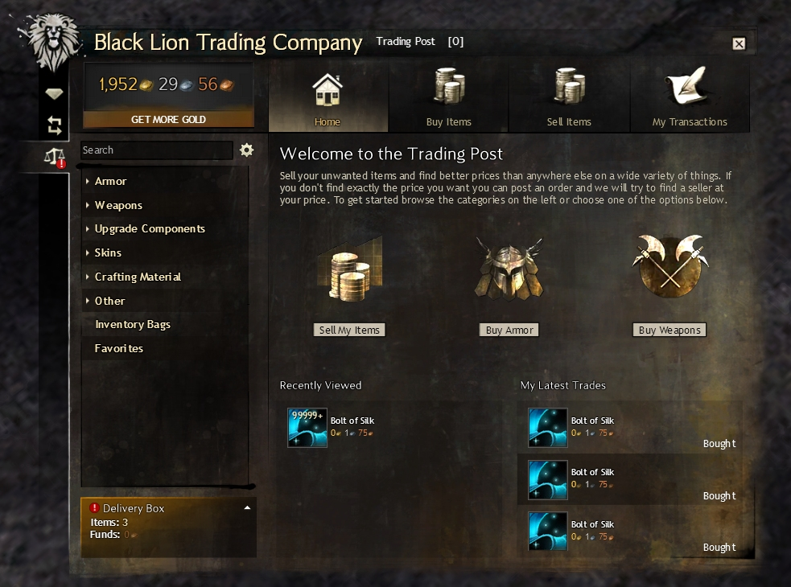

```{r init, message=FALSE, warning=FALSE, include=FALSE}
# Basics
library(tidyverse)
library(readr)
library(visdat)

# Plotting
library(ggplot2)
library(gt)
library(gtable)
library(DT)

# Working with models
library(rsample)
library(tidymodels)
library(GGally)
library(corrr)
library(parsnip)
library(yardstick)

# own functions
source("../libs/prepare_data.R")

tidymodels_prefer()
```

```{r css-operations, message=FALSE, warning=FALSE, include=FALSE}
knitr::opts_chunk$set(class.source = "code-chunks")
```


# Summary

In this report I'll give a short overview of the work done during the data science project in `Programming Languages for Data Science`.
I worked on the whole **Data Science Lifecycle** from the idea to the final insights and model. 

The topic is about **online auctions** using an online game called `Guild Wars 2` as an example. The data was fetched from the Web API provided by the game developers. We talk about around `5.000.000 datasets` so I had to concentrate on the most valuable items first.

The goal was to find out if there are items that can be bought low and sold high to earn (virtual) money. This was pretty much possible only with data analysis and visualization. Of cause those items are changing very fast, but as a conclusion I can say it's not possible to buy and sell "the one item", the gains are pretty low and it's only worth it when buying items in bulk.

As the data pretty much contains all data and doesn't yield a real question, for the model part, I wanted to find out and predict at which rate an item can be sold. The sober consideration is that it only depends on the buying price which selling price can be achieved. All other attributes like type, rarity or required level of the item did not have any effect on the outcome.

# Introduction

Malcolm Forbes once said, "Money isn't everything as long as you have enough of it".
Sure, money doesn't buy happiness, but it can buy a lot of things. This is not only true for the real world, but especially in online games, where micro transactions and payed services have become the new normal. 

More and more games give you the choice to invest a lot of time *or* a lot of money. Both ways you'll somehow achieve the goal of the game faster. In some games you can even exchange digital goods for real money.

To get to the point, having digital currency in games can save you time, stress and even real money.

There are multiple ways to earn money in games.
One way may be farming, which means hunting special items in high amounts and selling them to other players. Here's the question, which items are worth collecting and can be sold for which prices?

Another way is buying items from other players and reselling them with a higher price tag, just like in the real world.
Many games have auction houses where those transactions can be made. For this type of income one needs to know what to buy when, which prices are low or high, and when to sell for which amount.

For this project my example of game will be Guild Wars 2. Guild Wars 2 was published in 2012 by NCSoft. There are no monthly fees and the basic game is free to play since 2015. It is a massively multiplayer online role-playing game, meaning a lot of people playing in parallel in an online world. There are over 20.000 items that can be collected and most of them can be sold and bought at the auction house, called the trading post.



When selling items, 5% of the cost is a fee for the auction house and gets immediately taken from the wallet.
Each time an item is placed in the auction house, this 5% fee must be payed, so it's best if the items get sold on the first run.

When buying items, 10% of the price goes to the bank before the rest is delivered to the seller.

Because of that it's important to find items where the buy-to-sell price ratio is the highest.
In addition, as we buy **and** sell, we have to pay the whole 15% taxes which lowers our revenue.

Here is one example:

1. We want to buy an item so we create a new order with the highest order price (say: 1 gold)
2. As soon as another player wants to sell this item, the player will sell it to us (for 1 gold)
3. We then create a new auction for this item using the lowest offer price (say: 2 gold). We have to pay 5% for creating this auction.
4. As soon as another player wants to buy this item, the player will buy it from us for 2 gold. During this transaction, 10% is a fee for the bank, so we get 10% less.

Overall, we invested `1.05 gold` and earned `1.8 gold`. This is a revenue of (only) `0.75 gold`.


Just like in the real world, where 100 cents are 1 Euro, the main currency in Guild Wars, coins, are separated into three units.
There is **copper**, **silver** and **gold**. 

The following values are all the same and are automatically calculated by the game:
`
10.000 copper == 100 silver == 1 gold.

For this project, data is generally displayed in gold.

# Working with the data

## Data ingestion

We need to get the data first. We scrap the data from `https://api.guildwars2.com/v2/commerce/`. First we get all `26800` items and, in batches of `200` items per request, get all auctions for these items. It's really important to use the batch endpoint to keep the runtime to a reasonable duration.

```{r load_csv, message=FALSE, warning=FALSE}
dir <- getwd()
date <- params$data_date

price_list_buys <- read.csv(paste(dir, "/../data/raw/gw2-all-buys-raw-", date, ".csv", sep = ""))
price_list_sells <- read.csv(paste(dir, "/../data/raw/gw2-all-sells-raw-", date, ".csv", sep = ""))
item_list <- read.csv(paste(dir, "/../data/raw/gw2-all-items-raw-", date, ".csv", sep = ""))

df_buys <- item_list %>% left_join(price_list_buys, by = "id")
df_sells <- item_list %>% left_join(price_list_sells, by = "id")

rm(dir)
rm(date)
rm(item_list)
rm(price_list_sells)
rm(price_list_buys)
```

First we clean the data and change some feature types.
As already said, most of the time we use the price in gold, so we add this feature.

```{r data_cleaning }
df_sells <- df_sells %>% 
  drop_na(unit_price, quantity) %>% 
  mutate(rarity = as.factor(rarity),
         type = as.factor(type),
         item_type = as.factor(item_type),
         item_weight_class = as.factor(item_weight_class),
         unit_price_gold = unit_price / 10000) %>% 
  select(-unit_price)

df_buys <- df_buys %>% 
  drop_na(unit_price, quantity) %>% 
  mutate(rarity = as.factor(rarity),
         type = as.factor(type),
         item_type = as.factor(item_type),
         item_weight_class = as.factor(item_weight_class),
         unit_price_gold = unit_price / 10000) %>% 
  select(-unit_price)
```


After acquiring the data this way we have one file with all the **items**, one with all the **sell orders** (`r nrow(df_sells)`) and one with all the **buy orders** (`r nrow(df_buys)`). When joining those files together, the amount of data would be enormous.

### Filter on highest buy and lowest sell orders

Therefore some filtering is required first. We only take the highest buy orders and the lowest sell orders, because these are the first ones to be bought/sold.

```{r filter_buys_sells}
df_max_buys <-  df_buys %>% 
  group_by(name) %>% 
  slice(which.max(unit_price_gold))

df_min_sells <-  df_sells %>% 
  group_by(name) %>% 
  slice(which.min(unit_price_gold))
```

Now we can join the sell and buy orders and calculate the profit per item according to the tax rules described earlier.

```{r merge_buys_sells, message=FALSE, warning=FALSE}
df_all <- df_max_buys %>%
  mutate(quantity_buys = quantity,
         unit_price_gold_buys = unit_price_gold) %>% 
  select(-quantity, -unit_price_gold) %>% 
  right_join(df_min_sells %>% 
              mutate(quantity_sells = quantity,
                     unit_price_gold_sells = unit_price_gold) %>% 
              select(id, quantity_sells, unit_price_gold_sells), by = "id") %>% 
  mutate(name = name.x) %>% 
  select(-name.x, -name.y)

```

```{r create_profit_feature }
df_all <- df_all %>% 
  mutate(unit_price_gold_diff = unit_price_gold_sells - unit_price_gold_buys,
         profit = 0.85 * unit_price_gold_sells - unit_price_gold_buys,
         more_sells = quantity_sells - quantity_buys)
```


```{r plot_outliers, message=FALSE, warning=FALSE}
df_all %>% 
ggplot() +  
  geom_boxplot(aes(x = 'Sells', y = unit_price_gold_sells)) +
  geom_boxplot(aes(x = 'Buys', y = unit_price_gold_buys)) +
  geom_boxplot(aes(x = 'Profit', y = profit)) +
  geom_hline(yintercept = 3000, linetype="dashed", color = "red") +
  geom_hline(yintercept = 100, linetype="dashed", color = "blue") +
  scale_y_continuous(labels = comma) +
  labs(title = "Outliers on buys and sells", subtitle = "Baseline between 100 and 3000 gold",
    x = "", y = "Price in gold", caption = paste("Data from", params$data_date))
```

As we can see there are some very high outliers and a lot of outliers between around 100 and 3000 gold.
We need to zoom in much more to see the details.

```{r plot_outliers_zoom_sells }
df_all %>% 
  subset(profit < 2.5 & profit > 0) %>% 
ggplot() +  
  geom_boxplot(aes(x = 'Profit', y = profit)) +
  geom_text(aes(x = 'Profit', y = median(profit), label = median(profit)), size = 3, vjust = -0.5) +
  scale_y_continuous(labels = comma) +
  labs(title = "Outliers on profit and sells", subtitle = "Limit at 2.5 gold profit and sell price",
    x = "", y = "Price in gold", caption = paste("Data from", params$data_date))

median_profit_silver <- round(100 * df_all %>% 
  drop_na(profit) %>% 
  summarise(median(profit)) %>% 
  first(), 2)

median_profit_silver_filter <- round(100 * df_all %>% 
  subset(profit < 2.5 & profit > 0) %>% 
  drop_na(profit) %>% 
  summarise(median(profit)) %>% 
  first(), 2)
```


> The median profit is not in the gold range, but at `r median_profit_silver` silver. When filtering with reasonable bounds, the profit even falls to `r median_profit_silver_filter` silver.

### Filter on realistic profits

We can now strip down the data even further.

Let's take only the items with a realistic profit and strip away the items where it would be better to sell them to the non-player vendor instead of placing them in the auction house.

```{r filter_by_profit }
df_all <- df_all %>% 
  subset(profit > 0.07 & profit < 0.4)

df_all <- df_all %>% 
  subset(profit * 100 > vendor_value) %>% 
  arrange(desc(profit))
```

Now only `r nrow(df_all)` items left.
Let's have a closer look at those items.

```{r df_all_overview, message=FALSE, warning=FALSE}

df_all %>%
  group_by(type, rarity) %>% 
  summarise(name = unique(name),
            profit = profit * 100,
            icon = min(web_image(icon, height = 50))
            ) %>% 
  drop_na() %>% 
  arrange(desc(profit)) %>%
  gt(rowname_col = "name") %>%
  tab_header(title = "Realistic top profit items", subtitle = "by type and rarity") %>%
  fmt_number(
    columns = profit,
    suffixing = "S"
  ) %>% 
  fmt_markdown(
    columns = icon
  ) %>% 
  summary_rows(
    groups = TRUE,
    columns = profit,
    fns = list(average = "mean"),
    formatter = fmt_number
  ) %>%
  tab_footnote(
    footnote = "Prices in silver",
    locations = cells_column_labels(columns = profit)
  ) %>%
  tab_source_note(
    "Based on data from api.guildwars2.com"
  ) %>% 
  tab_options(
    summary_row.background.color = "#ACEACE",
    row_group.background.color = "#FFEFDB",
    table.layout = "auto",
    container.overflow.x = TRUE,
    container.height = px(450)
  )
```

## Data splitting

To make the data split reproducible, we set a seed.
We want to predict the gold price based on attributes of the items.

```{r create_data_split}
set.seed(42)

# Put 3/4 of the data into the training set 
data_split <- initial_split(df_all, 
                           prop = 3/4, 
                           strata = profit, 
                           breaks = 4)

# Create dataframes for the two sets:
train_data <- training(data_split) 
test_data <- testing(data_split)

df_train <- train_data 
```

From now on we will work with the train data (`df_train`).

## Analyze data

### Find correlations

```{r spearman_analysis}
df_train %>% 
  select(where(is.numeric), -more_sells, -profit, -unit_price_gold_diff) %>% # only select numerical data
  vis_cor(cor_method = "spearman", na_action = "pairwise.complete.obs")
```

We see that our data is pretty uncorrelated which makes it hard to find a good classification model. What we see is that buy and sell price are somewhat correlated as well as the level of the item to the vendor value.

The latter makes sense, as there must be some kind of algorithm that sets the sell price, probably also based on the item's level.

> Following idea: A model that predicts the sell price based on the buy price. Then we search for outliers where the sell price was predicted too high. Maybe those items are underrated somehow?

### Price distribution

Let's have a look at the distribution of profit in general for these items. We can see that the types are distributed pretty evenly within our small profit range.

```{r profit_distribution}
df_train_distribution <- df_train %>% 
  group_by(name) %>% 
  summarise(mean_profit = mean(profit),
            type = unique(type),
            rarity = unique(rarity)) %>% 
  arrange(desc(mean_profit))
  
df_train_distribution %>% 
  ggplot() +
  geom_bar(aes(x =  mean_profit, fill = type), stat="count") +
  scale_x_binned(limits = c(0.05, 0.4)) +
  labs(x = "Mean profit", y = "Count",
       title = "Item profit distribution", subtitle = "Items by profit, in gold", 
       caption = paste("Data from", params$data_date))
```


### Cluster Analysis

To get a better overview how the item buy costs and profits relate to each other, we'll do a cluster analysis.
(taken from https://www.kirenz.com/post/2020-05-21-r-hierarchische-clusteranalyse/)

We use z-transformation to bring the mean to 0 and varianz of the variables to 1.


```{r scale_profit_costs}
df_cl <- df_train %>% 
  select(c("id", "profit", "unit_price_gold_buys"))

df_cl$profit <- scale(df_cl$profit, center = TRUE, scale = TRUE)
df_cl$unit_price_gold_buys <- scale(df_cl$unit_price_gold_buys, center = TRUE, scale = TRUE)
```

```{r calculate_cluster}
d <- 
  df_cl %>% 
  select(-id) %>% 
  dist(method = "euclidean")

hc <- hclust(d, method = "ward.D2") 
plot(hc) 
```

The dendrogram displays the number of clusters. The higher the height on y-axis, the less similar are the clusters to each other.
Because there is a big gap between ~ 5 and ~ 10 which would result in only two clusters, five clusters seem fine.

```{r plot_items_clustered_5}

hc$labels <- df_cl$id

grp <- cutree(hc, k = 5) 
df_cl$cluster <- grp

df_cl %>% 
  ggplot(aes(unit_price_gold_buys, 
             profit, 
             color = factor(cluster))) +
  geom_point() +
  # geom_text(aes(label = id), size = 3, check_overlap = FALSE, vjust = 0, nudge_y = 0.1) +
  xlab("Buy Costs transformed") +
  ylab("Profit transformed") +
  theme(legend.title=element_blank())

rm(d)
rm(hc)
rm(grp)
```
Because we scaled the numbers we can't really say something about the real value of the items, but most of them are in the lower cost / lower profit range.

Four clusters were created out of the data:

- The "(1) red" cluster are low-cost items with low profit (don't buys)
- The "(2) yellow" cluster are mid-cost items with different profit (don't buys) 
- The "(3) green" cluster are low-cost items with different profit (don't buys)
- The "(4) teal" cluster are high-cost items with moderate profit (could buys)
- The "(5) purple" cluster are low-cost items with high profit (must buys)

> The profit is not a question of buy costs, there are items with high profit for low and for high costs. 

> There are some items that are cheap but will bring good profit.

### Find profitable items

Starting with a low budget, we can't buy a lot of high-priced items. Therefore it's good to know which items get the most profit compared to their costs.
We always suppose *the worst* profit.

```{r get_high_roi }
df_train_high_roi <-  df_train %>% 
  group_by(name) %>% 
  summarise(
    id = unique(id),
    profitByCost = min(profit) / max(unit_price_gold_buys),
    profit = min(profit),
    cost = max(unit_price_gold_buys),
    sell = min(unit_price_gold_sells),
    quantity = min(quantity_buys),
    icon = unique(icon)
  ) %>% 
  ungroup() %>% 
  arrange(desc(profitByCost))
```

```{r display_high_profit_regression}
df_train_high_roi %>% 
  ggplot(aes(x = cost,  y = profit)) +
  geom_point() +
  geom_smooth(method='lm', formula= y~x) +
  labs(x = "Cost", y = "Profit",
       title = "Cost and Profit of Items", subtitle = "Prices in gold",
       caption = paste("Data from", params$data_date))
```

This is basically the same picture we saw earlier on cluster analysis, but with the real profit values.
A line for linear models is added to see which values worthy (above the line) and which ones are not.

Let's have a closer look at those items. Because the prices are in the lower silver range again, they are displayed as silver here:

```{r plot_high_roi_table }
df_train_high_roi %>% 
  mutate(
    profitByCost = round(profitByCost, digits = 2),
    profit = round(profit * 100, digits = 2),
    cost = round(cost * 100, digits = 2),
    sell = round(sell * 100, digits = 2),
    icon = paste("</img>")
    ) %>% 
  filter(profit > 0) %>% 
  select(icon, name, profitByCost, profit, cost, sell, quantity) %>% 
  datatable(extensions = c('ColReorder', 'Buttons', 'Responsive', 'Scroller', 'SearchPanes', 'Select'),
            options = list(colReorder = TRUE,
                           dom = 'Bfrtip', 
                           buttons = list('searchPanes', 'copy', list(
                                           extend = 'collection',
                                           buttons = c('csv', 'excel', 'pdf'), 
                                           text = 'Download'))),
            escape = FALSE,
            colnames=c("Icon", "Name", "Profit by cost", "Profit", "Buy costs", "Sell revenue", "Quantity")
            )
```

## Model

### Feature Selection

As we saw while analyzing the data, the features are uncorrelated except buy and sell prices.

After testing, the prediction is even better when we take only the `unit_price_gold_buys` feature into account in opposite to taking more features into account like `type`, `rarity` or `level`. To make this clear, we first take all features and look for correlations.

```{r create_train_model }
df_train <- train_data %>% 
  select(id, name, unit_price_gold_sells, unit_price_gold_buys, type, rarity, level) %>% 
  drop_na()
```

```{r create_recipe }
sells_rec <- 
  recipe(unit_price_gold_sells ~ ., data = df_train) %>% 
  update_role(id, name, new_role = "ID") %>% 
  step_dummy(all_nominal_predictors())%>% 
  step_zv(all_predictors()) %>%  # remove zero vectors
  step_center(all_predictors()) %>%
  step_scale(all_predictors())

summary(sells_rec)
```

We now have four predictors and one outcome. The other fields are for reference if we want to dig deeper into the results of the model.

The recipe creates dummy variables for all nominal predictors, this is useful for `type` and `rarity`.

`zv` would removes all n/a vectors which would be helpful for `item_type` and `item_weight_class` as these values are not present for all rows, but we don't use these features.

Finally the `unit_price_gold_buys` will be centered and scaled to better work with the algorithm.

### Training

We use the `random forest` regression model to train with the `ranger` engine, and the `linear regression` model using the `glmnet` engine.
In opposite to the `glm` engine, `glmnet` only supports inputs with more than one predictor.

```{r ml_workflow }
# parsnip model
set.seed(42)

rf_mod <- 
  rand_forest() %>% 
  set_engine("ranger") %>% 
  set_mode("regression")

lasso_mod <- 
  linear_reg(penalty = 0.1, mixture = 1) %>% 
  set_engine("glmnet")

sells_wflow <- 
  workflow() %>% 
  add_recipe(sells_rec) 

rf_wflow <- 
  sells_wflow %>% 
  add_model(rf_mod)


lasso_wflow <- 
  sells_wflow %>% 
  add_model(lasso_mod)

rf_wflow
lasso_wflow
```

### Evaluation

We can now fit the train data and check the results with our two different models.

One for random forest:

```{r fit_rf_model }
sells_fit <- 
  rf_wflow %>% 
  fit(data = df_train)

sells_rf_aug <- 
  augment(sells_fit, test_data)

sells_rf_aug %>% 
  select(name, unit_price_gold_sells, .pred)

sells_rf_aug %>% 
  metrics(truth = unit_price_gold_sells, estimate = .pred)
```

One for lasso:

```{r fit_lasso_model }
sells_fit <- 
  lasso_wflow %>% 
  fit(data = df_train)

sells_lasso_aug <- 
  augment(sells_fit, test_data)

sells_lasso_aug %>% 
  select(name, unit_price_gold_sells, .pred)

sells_lasso_aug %>% 
  metrics(truth = unit_price_gold_sells, estimate = .pred)
```

Comparing the errors of those two engines, the random forest algorithm has a much higher root mean square error and mean absolute error.
Both models are overwhelmingly exact, random forest on 94% of the time and lasso on 99,988%.

```{r feature_influence, message=FALSE, warning=FALSE}
sells_fit %>%
  extract_fit_parsnip() %>%
  tidy()
```

Now we have it in numbers that the only feature that has influence on our prediction is the buying price.
Maybe we can change this using hyper parameter tuning.

### Tuning

Therefore we are tuning with 50 different levels of parameters.

```{r tuning_bootstrap }
set.seed(1234)

sells_boot <- bootstraps(df_train)

tune_spec <- linear_reg(penalty = tune(), mixture = 1) %>%
  set_engine("glmnet")

lambda_grid <- grid_regular(penalty(), levels = 50)
```

```{r tuning_grid }
doParallel::registerDoParallel()

set.seed(2020)

lasso_grid <- 
  tune_grid(
  sells_wflow %>% 
    add_model(tune_spec),
    resamples = sells_boot,
    grid = lambda_grid
)

lasso_grid %>%
  collect_metrics()
```

```{r tuning_metrics }
lasso_grid %>%
  collect_metrics() %>%
  ggplot(aes(penalty, mean, color = .metric)) +
  geom_errorbar(aes(ymin = mean - std_err,
                    ymax = mean + std_err),
                alpha = 0.5) +
  geom_line(size = 1.5) +
  facet_wrap(~.metric, scales = "free", nrow = 2) +
  scale_x_log10() +
  theme(legend.position = "none")
```

Well bad luck, nothing to gain here. The rmse even raises after too much tuning.

Nonetheless, the error values are already pretty low.

```{r visualize_model }

sells_join_aug <- sells_lasso_aug %>% 
  select(id = id, lasso_pred = .pred, unit_price_gold_sells, type) %>% 
  left_join(sells_rf_aug %>% select(id = id, rf_pred = .pred), by = "id")

sells_join_aug %>%  
  ggplot() +
  geom_point(aes(x = rf_pred, y = unit_price_gold_sells), color = "#11ff00") +
  geom_point(aes(x = lasso_pred, y = unit_price_gold_sells), color = "#ff0000") +
  geom_abline(col = "red", lty = 2) +
  labs(x = "Predicted buy value", y = "Buy value",
       title = "Item price predictions", subtitle = "Using random forest (green) and lasso regressions (red)",
       color = c("A", "B"),
       caption = paste("Data from", params$data_date))
```

What is interesting for us are the prices that are blow the prediction line, meaning that there may be a current low that will probably change in the future.

### Evaluate on test set

Do the last fit on the test data. We changed no parameter so the output should be the same as before.

```{r last_fit }
# final evaluation with test data
last_fit_lasso <- last_fit(lasso_wflow, split = data_split)

# show RMSE and RSQ
last_fit_lasso %>% 
  collect_metrics()
```


## Use Model on new data

We can now try to use a whole new dataset and let the model run on that one.

```{r load_csv_2, message=FALSE, warning=FALSE}
dir <- getwd()
date <- "2022-05-07"

price_list_buys <- read.csv(paste(dir, "/../data/raw/gw2-all-buys-raw-", date, ".csv", sep = ""))
price_list_sells <- read.csv(paste(dir, "/../data/raw/gw2-all-sells-raw-", date, ".csv", sep = ""))
item_list <- read.csv(paste(dir, "/../data/raw/gw2-all-items-raw-", date, ".csv", sep = ""))

df_buys <- item_list %>% left_join(price_list_buys, by = "id")
df_sells <- item_list %>% left_join(price_list_sells, by = "id")

rm(dir)
rm(item_list)
rm(price_list_sells)
rm(price_list_buys)
```

Do the whole data cleaning in one function.

```{r prepare_data_2, message=FALSE, warning=FALSE}
df_all <- prepare_data(df_sells, df_buys)
```

Run the model again

```{r run_model_2 }
sells_lasso_aug <- 
  augment(sells_fit, df_all)

sells_lasso_aug %>% 
  select(name, unit_price_gold_sells, .pred)

sells_lasso_aug %>% 
  metrics(truth = unit_price_gold_sells, estimate = .pred)
```

The numbers look pretty equal but when zooming in to < 1 gold profit, we see some minor deviations.

```{r evaluate_model_2 }
sells_lasso_aug %>%  
  subset(.pred < 1) %>% 
  ggplot() +
  geom_point(aes(x = .pred, y = unit_price_gold_sells, color = type)) +
  geom_abline(col = "red", lty = 2) +
  labs(x = "Predicted buy value", y = "Buy value",
       title = "Item price predictions", subtitle = "prediction < 1 gold")
```
Especially lower cost items like creafting material is underrated. 

> Buy and sell prices are really closely correlated. Therefore it's easy for the model to predict them. 

> There are no outliers, the market regulates itself.

# Outcome

The dataset behaved very differently than I thought. There is a lot of data but the really relevant parts are only highest sell and lowest buy prices.
Auctions are changing so fast that static analysis isn't a good fit. After creating an auction it didn't take long until others were undercutting my prices.
Therefore I was not able to reach my gold of earning `18 gold and 6 silver (worth 1$)`. There are still some running auctions but after all I was able to earn only `57 silver and 70 copper`. In addition, this method is really time consuming checking auctions now and then, and it doesn't really spark joy. It's clear that I'm not the first and only one who tries to earn money that way, which gets obvious when looking at existing fan pages like [GW2Efficiency](https://gw2efficiency.com/tradingpost) and [GW2TP](https://de.gw2tp.com/).
