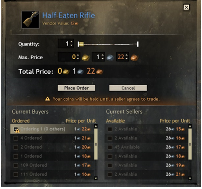
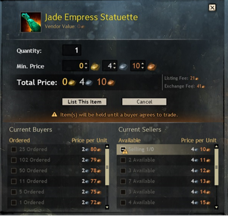
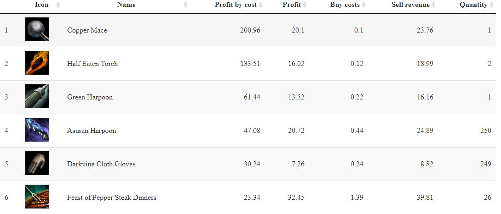

```{r load_packages, message=FALSE, warning=FALSE, include=FALSE}
# API
library(httr)
library(jsonlite)

# Basics
library(tidyverse)
library(readr)
library(visdat)

# Plotting
library(ggplot2)
library(gt)
library(gtable)
library(DT)

# Working with models
library(rsample)
library(tidymodels)
library(GGally)
library(corrr)
library(parsnip)
library(yardstick)

# own functions
source("../libs/prepare_data.R")

tidymodels_prefer()
```

```{r setup, include=FALSE}
knitr::opts_chunk$set(echo = FALSE)
```

## Motivation

"Money isn't everything as long as you have enough of it" - Malcolm Forbes


## Angebot und Nachfrage

:::::: {.columns}
::: {.column}
Für uns sind nur zwei Einträge relevant


:::

::: {.column}

:::
::::::

## Profit

Das Auktionshaus erhebt Steuern.

- 5% für das Einstellen eines Angebots
- 10% beim Verkauf

Ein Beispiel:

- Kauf für 1,22 Silber
- Verkauf für 26,14 Silber
  -  5% davon werden direkt abgezogen
  -  10% davon werden bei Kauf abgezogen
- Wir bekommen 26,14 * 0,85 = 22,22 Silber

Abzüglich Kaufpreis ergibt das ein Gewinn von 21 Silber.

## Datenbeschaffung

```{r data_scraping, include=FALSE}
  listings_response <- GET("https://api.guildwars2.com/v2/commerce/listings")
  all_items <-  content(listings_response, "text") %>% fromJSON()
  #cat(paste("Found ", length(all_items), "items in total.\n"))
  
  item_list <- NULL
  price_list_buys <- NULL
  price_list_sells <- NULL
  
  take <- 400 # 26800
  batch_size <- 200 # higher batch sizes are much better. 200 is the maximum.

  # get price lists
  for (i in 0:(take/batch_size - 1))
  {
    rowBatch <- (batch_size*i + 1):(batch_size * (i + 1))
    currentBatch <- all_items[rowBatch] %>% paste(collapse = ",")
   
    # get price details
    price_response <- GET(paste("https://api.guildwars2.com/v2/commerce/listings?ids=",
                                currentBatch,
                                sep = ""))
    
    # validate response code
    if (price_response$status_code != "200" || str_starts(content(price_response, "text"), "<html>"))
    {
      cat(paste("Error getting prices in batch ", i, ":", price_response$status_code, 
                " :: ", price_response, ".\n"))
      
      next
    }
    
    price_response_n <- content(price_response, "text") %>% fromJSON()
    
    # process price_list_buys
    for (row in 0:nrow(price_response_n))
    {
      id <- price_response_n[row, "id"]
      buy <- price_response_n[row, "buys"]
    
      if (length(buy) > 0)
      {
        value <- buy[[1]] %>% 
          as_tibble(.name_repair = "minimal") %>%  # minimal == No name repair or checks, beyond basic existence
          mutate(id = id)
        
        price_list_buys <- price_list_buys %>% bind_rows(value) # combine data frames
      }
    }
    
    # process price_list_sells
    for (row in 0:nrow(price_response_n))
    {
      id <- price_response_n[row, "id"]
      sell <- price_response_n[row, "sells"]
    
      if (length(sell) > 0)
      {
        value <- sell[[1]] %>% 
          as_tibble(.name_repair = "minimal") %>% 
          mutate(id = id)
        
        price_list_sells <- price_list_sells %>% bind_rows(value)
      }
    }
    
    # cat(paste("Getting prices, batch ", i + 1, "/", take/batch_size, ".\n"))
  }
  
  # get item details
  for (i in 0:(take/batch_size - 1))
  {
    rowBatch <- (batch_size*i + 1):(batch_size * (i + 1))
    currentBatch <- all_items[rowBatch] %>% 
      paste(collapse = ",")
   
    # get items details
    item_response <- GET(paste("https://api.guildwars2.com/v2/items?ids=",
                               currentBatch,
                               sep = ""))
    
    item_response_n <- content(item_response, "text") %>%
      fromJSON() %>% 
      select(any_of(c("name", "description", "type", "rarity",
                      "vendor_value", "id", "icon", "level", "flags", "details"))) %>% 
      mutate(
        id = as.integer(id),
        vendor_value = as.double(vendor_value)
      )
    
    if (is.null(item_list)) {
      item_list <- item_response_n
    } else {
      item_list <- item_list %>% 
        add_row(item_response_n)
    }
    
    # cat(paste("Getting items, batch ", i + 1, "/", take/batch_size, ".\n"))
  }
  
  item_list <- item_list %>% 
    mutate(
      item_type = item_list[["details"]][["type"]],
      item_weight_class = item_list[["details"]][["weight_class"]],
           ) %>% 
    select(-details, -flags, -description)

  dir <- getwd()
  date <- Sys.Date()

  #write_csv(price_list_buys, file = paste(dir, "/../data/raw/gw2-all-buys-raw-", date, ".csv", sep = ""))
  #write_csv(price_list_sells, file = paste(dir, "/../data/raw/gw2-all-sells-raw-", date, ".csv", sep = ""))
  #write_csv(item_list, file = paste(dir, "/../data/raw/gw2-all-items-raw-", date, ".csv", sep = ""))
```
Daten abrufen:

- Alle im Spiel befindlichen Gegenstände von der API abrufen: `r length(all_items)`
- Für diese Präsentation nehmen wir `r take` stück um die Ladezeit zu verringern
- Kauf- und Verkaufsauktionen für jeden Gegenstand abrufen
  - Kaufauktionen: `r nrow(price_list_buys)`
  - Verkaufsauktionen: `r nrow(price_list_sells)`
- Details pro Gegenstand wie Name, Icon etc.
  - `r nrow(price_list_sells)` gefunden
- Alle Daten in CSVs schreiben

## Daten als JSON von der API lesen

```{#mycode .R .numberLines}
# Call API - get price details
price_response <- GET(paste("https://api.guildwars2.com/v2/commerce/listings?ids=", currentBatch, sep = ""))

# Parse JSON
price_response_n <- content(price_response, "text") %>% fromJSON()

# Read content (mockup)
id <- price_response_n[row, "id"]
buy <- price_response_n[row, "buys"]
```

## Data preparation

```{r load_csv, message=FALSE, warning=FALSE}
dir <- getwd()
date <- params$data_date

price_list_buys <- read.csv(paste(dir, "/../data/raw/gw2-all-buys-raw-", date, ".csv", sep = ""))
price_list_sells <- read.csv(paste(dir, "/../data/raw/gw2-all-sells-raw-", date, ".csv", sep = ""))
item_list <- read.csv(paste(dir, "/../data/raw/gw2-all-items-raw-", date, ".csv", sep = ""))

df_buys <- item_list %>% left_join(price_list_buys, by = "id")
df_sells <- item_list %>% left_join(price_list_sells, by = "id")

rm(dir)
rm(date)
rm(item_list)
rm(price_list_sells)
rm(price_list_buys)
```

Die Daten liegen bis jetzt verteilt in drei Dateien. Diese müssen zuerst zusammengeführt werden. Danach sehen die Daten so aus:

```{r}
glimpse(df_buys)
```
## Data cleaning I

```{r data_cleaning }
df_sells <- df_sells %>% 
  drop_na(unit_price, quantity) %>% 
  mutate(rarity = as.factor(rarity),
         type = as.factor(type),
         item_type = as.factor(item_type),
         item_weight_class = as.factor(item_weight_class),
         unit_price_gold = unit_price / 10000) %>% 
  select(-unit_price)

df_buys <- df_buys %>% 
  drop_na(unit_price, quantity) %>% 
  mutate(rarity = as.factor(rarity),
         type = as.factor(type),
         item_type = as.factor(item_type),
         item_weight_class = as.factor(item_weight_class),
         unit_price_gold = unit_price / 10000) %>% 
  select(-unit_price)
```

Da die Daten von einer API kommen, sind sie größtenteils schon aufbereitet. Allerdings lassen sich einige Variablen noch besser verarbeiten:

```{#mycode .R .numberLines}
df_sells <- df_sells %>% 
  drop_na(unit_price, quantity) %>% 
  mutate(rarity = as.factor(rarity),
         type = as.factor(type),
         item_type = as.factor(item_type),
         item_weight_class = as.factor(item_weight_class),
         unit_price_gold = unit_price / 10000) %>% 
  select(-unit_price)
```

## Data cleaning II

Wie bereits erwähnt, interessieren uns nur die attraktivsten Angebote (analog Käufe/Verkäufe)

```{r}
df_max_buys <- df_buys %>% 
  group_by(name) %>% 
  slice(which.max(unit_price_gold))

df_min_sells <- df_sells %>% 
  group_by(name) %>% 
  slice(which.min(unit_price_gold))
```

```{#mycode .R .numberLines}
df_max_buys <-  df_buys %>% 
  group_by(name) %>% 
  slice(which.max(unit_price_gold))
```

Damit wird das Datenset stark verringert:

- Kaufauktionen von `r nrow(df_buys)` auf `r nrow(df_max_buys)`
- Verkaufsauktionen von `r nrow(df_sells)` auf `r nrow(df_min_sells)`

## Berechnung des Profits

```{r merge_buys_sells, message=FALSE, warning=FALSE}
df_all <- df_max_buys %>%
  mutate(quantity_buys = quantity,
         unit_price_gold_buys = unit_price_gold) %>% 
  select(-quantity, -unit_price_gold) %>% 
  right_join(df_min_sells %>% 
              mutate(quantity_sells = quantity,
                     unit_price_gold_sells = unit_price_gold) %>% 
              select(id, quantity_sells, unit_price_gold_sells), by = "id") %>% 
  mutate(name = name.x) %>% 
  select(-name.x, -name.y)

```

```{r create_profit_feature }
df_all <- df_all %>% 
  mutate(unit_price_gold_diff = unit_price_gold_sells - unit_price_gold_buys,
         profit = 0.85 * unit_price_gold_sells - unit_price_gold_buys,
         more_sells = quantity_sells - quantity_buys)
```

Jetzt ist das Datenset handlebar. Erst wird `df_max_buys` und `df_min_sells` anhand der ID gejoined und dann kann der Profit pro Gegenstand berechnet werden.

```{#mycode .R .numberLines}
df_all <- df_all %>% 
  mutate(unit_price_gold_diff = unit_price_gold_sells - unit_price_gold_buys,
         profit = 0.85 * unit_price_gold_sells - unit_price_gold_buys,
         more_sells = quantity_sells - quantity_buys)
```

## Daten Überblick

Es gibt vor allem bei den Verkäufen einige Ausreißer nach oben mit 3000 oder auch dem Maximum 10.000 Gold.
Diese und viele sehr hohe Angebote können aber nicht ernst genommen werden. 

```{r plot_outliers, message=FALSE, warning=FALSE}
df_all %>% 
  subset(profit < 2.5 & profit > 0) %>% 
ggplot() +
  geom_boxplot(aes(x = 'Profit', y = profit)) +
  geom_text(aes(x = 'Profit', y = median(profit), label = median(profit)), size = 3, vjust = -0.5) +
  scale_y_continuous(labels = comma) +
  labs(title = "Outliers on profit", subtitle = "Limit at 2.5 gold profit",
    x = "", y = "Price in gold", caption = paste("Data from", params$data_date))

median_profit_silver_filter <- round(100 * df_all %>% 
  subset(profit < 2.5 & profit > 0) %>% 
  drop_na(profit) %>% 
  summarise(median(profit)) %>% 
  first(), 2)
```

```{r filter_by_profit }
df_all <- df_all %>% 
  subset(profit > 0.07 & profit < 0.4)

df_all <- df_all %>% 
  subset(profit * 100 > vendor_value) %>% 
  arrange(desc(profit))
```

Daher wurde so gefiltert, dass der Profit 2,5 Gold nicht überschreitet. Dadurch ergibt sich ein Median beim Gewinn von `r median_profit_silver_filter` Silber. Es sind nun nur noch `r nrow(df_all)` Gegenstände übrig geblieben.

## Data Split

Alle bisherigen Operationen wurden auch in eine Funktion ausgelagert, sodass immer von diesem Datenset aus gearbeitet werden kann, auch wenn man neuere Daten über die API abruft. Die Daten werden nun in ein Training und ein Testset eingeteilt.

```{#mycode .R .numberLines}
data_split <- initial_split(df_all, 
                           prop = 3/4, 
                           strata = profit, 
                           breaks = 4)
                           
train_data <- training(data_split) 
test_data <- testing(data_split)
```

```{r create_data_split}
set.seed(42)

# Put 3/4 of the data into the training set 
data_split <- initial_split(df_all, 
                           prop = 3/4, 
                           strata = profit, 
                           breaks = 4)

# Create dataframes for the two sets:
train_data <- training(data_split) 
test_data <- testing(data_split)

df_train <- train_data
```

## Abhänigkeiten

Um zu sehen welche Input-Variablen relevant sind, kann das Spearman Schaubild weiterhelfen.

```{r spearman_analysis}
df_train %>% 
  select(where(is.numeric), -more_sells, -profit, -unit_price_gold_diff) %>% # only select numerical data
  vis_cor(cor_method = "spearman", na_action = "pairwise.complete.obs")
```

## Preisverteilung

```{r profit_distribution}
df_train_distribution <- df_train %>% 
  group_by(name) %>% 
  summarise(mean_profit = mean(profit),
            type = unique(type),
            rarity = unique(rarity)) %>% 
  arrange(desc(mean_profit))
  
df_train_distribution %>% 
  ggplot() +
  geom_bar(aes(x =  mean_profit, fill = type), stat="count") +
  scale_x_binned(limits = c(0.05, 0.4)) +
  labs(x = "Mean profit", y = "Count",
       title = "Item profit distribution", subtitle = "Items by profit, in gold", 
       caption = paste("Data from", params$data_date))
```

### Clusteranalyse I

Um einen besseren Überblick über die Daten zu bekommen, habe ich die Daten geclustert. In dem Dendrogram kann man sinnvolle Clustergrößen ablesen.

```{r scale_profit_costs}
df_cl <- df_train %>% 
  select(c("id", "profit", "unit_price_gold_buys"))

df_cl$profit <- scale(df_cl$profit, center = TRUE, scale = TRUE)
df_cl$unit_price_gold_buys <- scale(df_cl$unit_price_gold_buys, center = TRUE, scale = TRUE)
```

```{r calculate_cluster}
d <- 
  df_cl %>% 
  select(-id) %>% 
  dist(method = "euclidean")

hc <- hclust(d, method = "ward.D2") 
plot(hc) 
```

## Clusteranalyse II

Es wurden vier Cluster gebildet:
- Das "(1) rote" Cluster sind günstige Gegenstände mit Verlust (nicht kaufen)
- Das "(2) grüne" Cluster sind mittelpreisige Gegenstände mit unterschiedlichem Gewinn (nicht kaufen)
- Das "(3) hellblaue" Cluster sind günstige Gegenstände mit überwiegend hohem Gewinn (sollte man kaufen)
- Das "(4) lila" cluster sind hochpreisige Gegenstände mit hohem Gewinn (könnte man kaufen)

Es gibt also einige Gegenstände die für uns interessant sind.

```{r plot_items_clustered_4}

hc$labels <- df_cl$id

grp <- cutree(hc, k = 4) 
df_cl$cluster <- grp

df_cl %>% 
  ggplot(aes(unit_price_gold_buys, 
             profit, 
             color = factor(cluster))) +
  geom_point() +
  # geom_text(aes(label = id), size = 3, check_overlap = FALSE, vjust = 0, nudge_y = 0.1) +
  xlab("Buy Costs transformed") +
  ylab("Profit transformed") +
  theme(legend.title=element_blank())

rm(d)
rm(hc)
rm(grp)
```

## Beste Gegenstände nach ROI



## Zwischenüberlegung

Wir haben nun Gegenstände gefunden die einen hohen Gewinn erzielen würden. Jetzt kann man bereits anfangen diese zu Kaufen/Verkaufen und so Gewinn erziehlen.

Jedoch sollte auch ein Modell trainiert werden. Daher die Überlegung ein Modell zu trainieren, das den Verkaufspreis pro Gegenstand vorhersagt. Wenn es dabei Abweichungen zum tatsächlichen Kaufpreis gibt, könnte dies für ein Gegenstand stehen, der unter/überbewertet ist und sich in Zukunft zum vorhergesagten Wert entwickelt.

## Features auswählen

Folgende features wurden zu Beginn ausgewählt:

```{r create_train_model }
df_train <- train_data %>% 
  select(id, name, unit_price_gold_sells, unit_price_gold_buys, type, rarity, level) %>% 
  drop_na()
```

```{r create_recipe }
sells_rec <- 
  recipe(unit_price_gold_sells ~ ., data = df_train) %>% 
  update_role(id, name, new_role = "ID") %>% 
  step_dummy(all_nominal_predictors())%>% 
  step_zv(all_predictors()) %>%  # remove zero vectors
  step_center(all_predictors()) %>%
  step_scale(all_predictors())

summary(sells_rec)
```

## Modell aufbauen

Ich habe zwei verschiedene Regressionsalgorithmen ausprobiert. Den Regression des `Random Forest` und die Lasso-Regressions von `glm` bzw. `glmnet`. Das Rezept dazu sieht folgendermaßen aus:

```{#mycode .R .numberLines}
sells_rec <- 
    recipe(unit_price_gold_sells ~ ., data = df_train) %>% 
    update_role(id, name, new_role = "ID") %>% 
    step_dummy(all_nominal_predictors())%>% 
    step_zv(all_predictors()) %>%  # remove zero vectors
    step_center(all_predictors()) %>%
    step_scale(all_predictors())
  
  lasso_mod <- 
    linear_reg(penalty = 0.1, mixture = 1) %>% 
    set_engine("glmnet")
  
  sells_fit <- 
    workflow() %>% 
    add_recipe(sells_rec) %>%
    add_model(lasso_mod) %>% 
    fit(data = df_train)
```

```{r ml_workflow, message=FALSE, warning=FALSE, include=FALSE}
# parsnip model
set.seed(42)

rf_mod <- 
  rand_forest() %>% 
  set_engine("ranger") %>% 
  set_mode("regression")

lasso_mod <- 
  linear_reg(penalty = 0.1, mixture = 1) %>% 
  set_engine("glmnet")

sells_wflow <- 
  workflow() %>% 
  add_recipe(sells_rec) 

rf_wflow <- 
  sells_wflow %>% 
  add_model(rf_mod)


lasso_wflow <- 
  sells_wflow %>% 
  add_model(lasso_mod)

rf_wflow
lasso_wflow
```

```{r fit_rf_model, message=FALSE, warning=FALSE, include=FALSE}
sells_fit <- 
  rf_wflow %>% 
  fit(data = df_train)

sells_rf_aug <- 
  augment(sells_fit, test_data)

sells_rf_aug %>% 
  select(name, unit_price_gold_sells, .pred)

sells_rf_aug %>% 
  metrics(truth = unit_price_gold_sells, estimate = .pred)
```

```{r fit_lasso_model, message=FALSE, warning=FALSE, include=FALSE}
sells_fit <- 
  lasso_wflow %>% 
  fit(data = df_train)

sells_lasso_aug <- 
  augment(sells_fit, test_data)

sells_lasso_aug %>% 
  select(name, unit_price_gold_sells, .pred)

sells_lasso_aug %>% 
  metrics(truth = unit_price_gold_sells, estimate = .pred)
```

## Ergebnis

```{r visualize_model }

sells_join_aug <- sells_lasso_aug %>% 
  select(id = id, lasso_pred = .pred, unit_price_gold_sells, type) %>% 
  left_join(sells_rf_aug %>% select(id = id, rf_pred = .pred), by = "id")

sells_join_aug %>%  
  ggplot() +
  geom_point(aes(x = rf_pred, y = unit_price_gold_sells), color = "#05541a") +
  geom_point(aes(x = lasso_pred, y = unit_price_gold_sells), color = "#040552") +
  geom_abline(col = "red", lty = 2) +
  labs(x = "Predicted buy value", y = "Buy value",
       title = "Item price predictions", subtitle = "Using random forest (green) and lasso regressions (blue)",
       color = c("A", "B"),
       caption = paste("Data from", params$data_date))
```

## Einfluss der features auf das Ergebnis

```{r feature_influence, message=FALSE, warning=FALSE}
sells_fit %>%
  extract_fit_parsnip() %>%
  tidy()
```

## Tuning

Dadurch, dass nur eine Variable Einfluss auf das Modell hat, ist beim Hyperparametertuning kein hilfreiches Ergebnis zustande gekommen:

```{r tuning_bootstrap, include=FALSE}
set.seed(1234)

sells_boot <- bootstraps(df_train)

tune_spec <- linear_reg(penalty = tune(), mixture = 1) %>%
  set_engine("glmnet")

lambda_grid <- grid_regular(penalty(), levels = 50)
```

```{r tuning_grid, include=FALSE}
doParallel::registerDoParallel()

set.seed(2020)

lasso_grid <- 
  tune_grid(
  sells_wflow %>% 
    add_model(tune_spec),
    resamples = sells_boot,
    grid = lambda_grid
)

lasso_grid %>%
  collect_metrics()
```

```{r tuning_metrics }
lasso_grid %>%
  collect_metrics() %>%
  ggplot(aes(penalty, mean, color = .metric)) +
  geom_errorbar(aes(ymin = mean - std_err,
                    ymax = mean + std_err),
                alpha = 0.5) +
  geom_line(size = 1.5) +
  facet_wrap(~.metric, scales = "free", nrow = 2) +
  scale_x_log10() +
  theme(legend.position = "none")
```

## Ausführen auf neuen Daten

```{r load_csv_2, message=FALSE, warning=FALSE, include=FALSE}
dir <- getwd()
date <- "2022-04-06"

price_list_buys <- read.csv(paste(dir, "/../data/raw/gw2-all-buys-raw-", date, ".csv", sep = ""))
price_list_sells <- read.csv(paste(dir, "/../data/raw/gw2-all-sells-raw-", date, ".csv", sep = ""))
item_list <- read.csv(paste(dir, "/../data/raw/gw2-all-items-raw-", date, ".csv", sep = ""))

df_buys <- item_list %>% left_join(price_list_buys, by = "id")
df_sells <- item_list %>% left_join(price_list_sells, by = "id")

rm(dir)
rm(item_list)
rm(price_list_sells)
rm(price_list_buys)
```

```{r prepare_data_2, message=FALSE, warning=FALSE, include=FALSE}
df_all <- prepare_data(df_sells, df_buys)
```

```{r run_model_2, include=FALSE}
sells_lasso_aug <- 
  augment(sells_fit, df_all)

sells_lasso_aug %>% 
  select(name, unit_price_gold_sells, .pred)

sells_lasso_aug %>% 
  metrics(truth = unit_price_gold_sells, estimate = .pred)
```

Das Schaubild sieht sehr ähnlich zu dem vorherigen Ergebnis aus, daher wird auf Gewinn < 1 Gold gezoomt.

```{r evaluate_model_2 }
sells_lasso_aug %>%  
  subset(.pred < 1) %>% 
  ggplot() +
  geom_point(aes(x = .pred, y = unit_price_gold_sells, color = type)) +
  geom_abline(col = "red", lty = 2) +
  labs(x = "Predicted buy value", y = "Buy value",
       title = "Item price predictions", subtitle = "prediction < 1 gold")
```

## Ergebnis

Das Ziel war, `1$` in In-Game Währung zu verdienen, das entspricht `18 Gold und 6 Silber`.
Obwohl noch ein paar Auktionen laufen, konnte das Ziel nicht erreicht werden.

Tatsächlich habe ich aber Gewinn gemacht: `57 Silber und 70 Kupfer`. 
Finanziell hat sich das natürlich nicht gelohnt, aber es war eine interessante Erfahrung.

## Fazit

The dataset behaved very differently than I thought. There is a lot of data but the really relevant parts are only highest sell and lowest buy prices.
Auctions are changing so fast that static analysis isn't a good fit. After creating an auction it didn't take long until others were undercutting my prices.
Therefore I was not able to reach my gold of earning `18 gold and 6 silver (worth 1$)`. There are still some running auctions but after all I even have `1 gold 43 silver and 56 copper` less. In addition, this method is really time consuming checking auctions now and then, and it doesn't really spark joy. It's clear that I'm not the first and only one who tries to earn money that way, which gets obvious when looking at existing fan pages like [GW2Efficiency](https://gw2efficiency.com/tradingpost) and [GW2TP](https://de.gw2tp.com/).